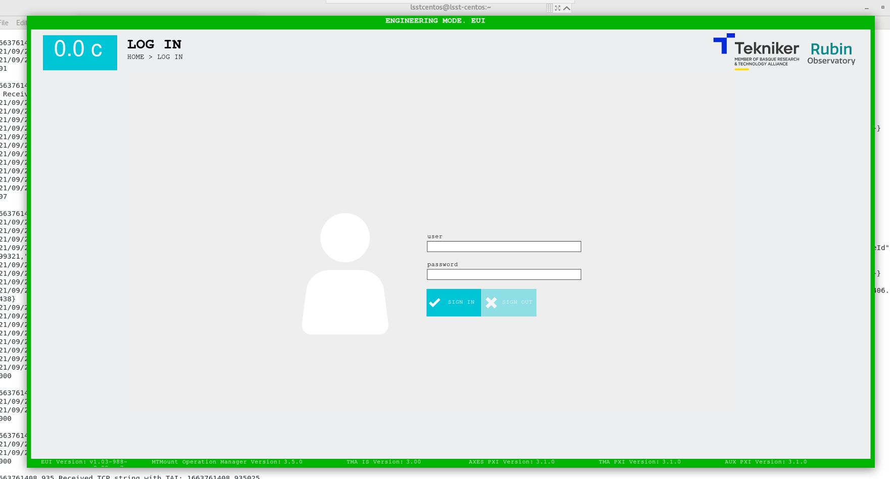
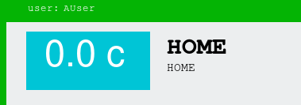
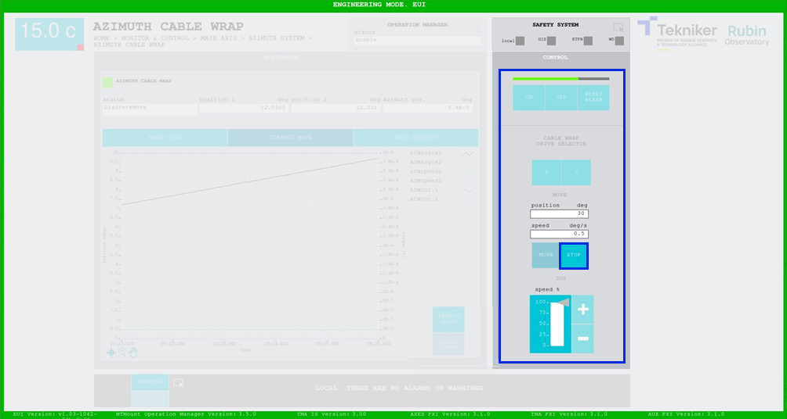
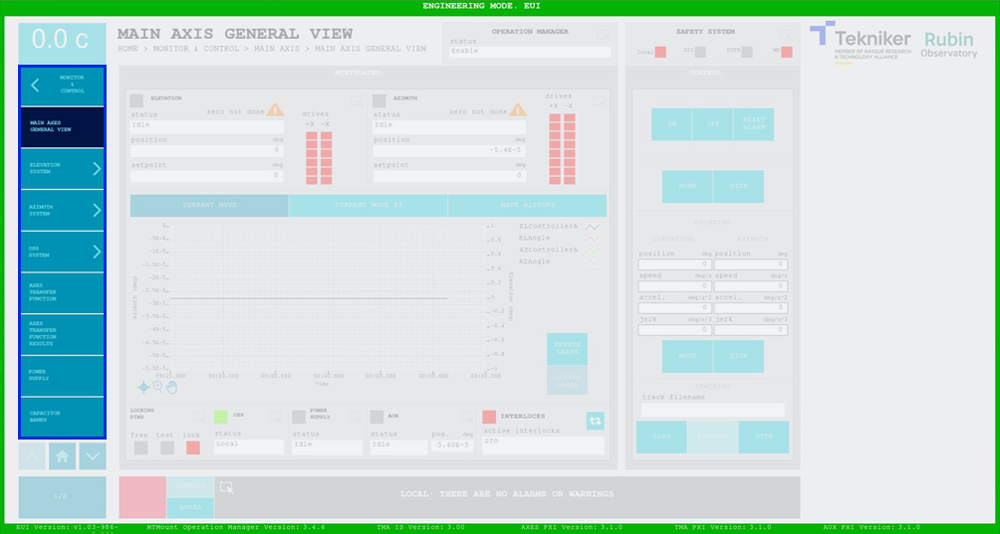
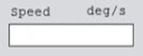
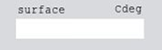

## DESCRIPTION OF SCREENS

### PRELIMINARY CONSIDERATIONS

#### Users

Not all screens are accessible to all users, so the user who is going to access the system and his/her respective
password needs to be entered on the session login screen, Figure 2-1.

There are four different user types:

- **A_Viewer**: These are viewer users. They are view only and cannot send commands to the telescope.
- **B_Operator**: These are operator users. They can send commands to the telescope, but cannot change the settings.
- **C_Advance**: These are advanced users. They can send commands to the telescope and change the most basic settings,
  always within the preset limits for each of them. This type of user cannot save settings permanently and their changes are temporary.
- **D_Maintenance**: These are maintenance users. They can perform all operations and set all settings within the limits pre-established for each of them.

*Figure 2‑1. Session login screen.*

Once logged in, the top left corner shows how is the current user.

*Figure 2‑1.1. Current user display.*

#### Operating modes

The telescope has three operating modes:

- **EUI (Engineering User Interface)**: Controls all elements and changes the settings (depending on the user).
- **HHD (Hand Held Device)**: Aimed at portable devices, it has certain restrictions relating to the EUI.
- **CSC (Commandable SAL Components)**: Only allows screens to be viewed.

#### Overview

The icons in the following figure appear on most screens and all function as links to other screens.

*Figure 2‑2. Accessing another screen.*

As soon as a command is executed, a progress bar appears at the top right of any of the screens, like the one shown in
Figure 2-3. All buttons except "Stop" are also disabled.

*Figure 2‑3. Progress bar.*

All "Monitor\&Control" screens have a screens menu as shown in Figure 2-4. This menu also remains hidden while a command
is executed. This is because a window cannot be closed while a command is being executed.

*Figure 2‑4. Screens menu.*

Any shortcuts that may be on that screen are disabled for the same reason.

Finally, two types of boxes can be found on all of the screens:

- Boxes with frames: these are controls and the values inside them can be changed.

*Figure 2‑5. Control example.*

- Frameless boxes: these are indicators and only display values.

*Figure 2‑6. Indicator example.*
