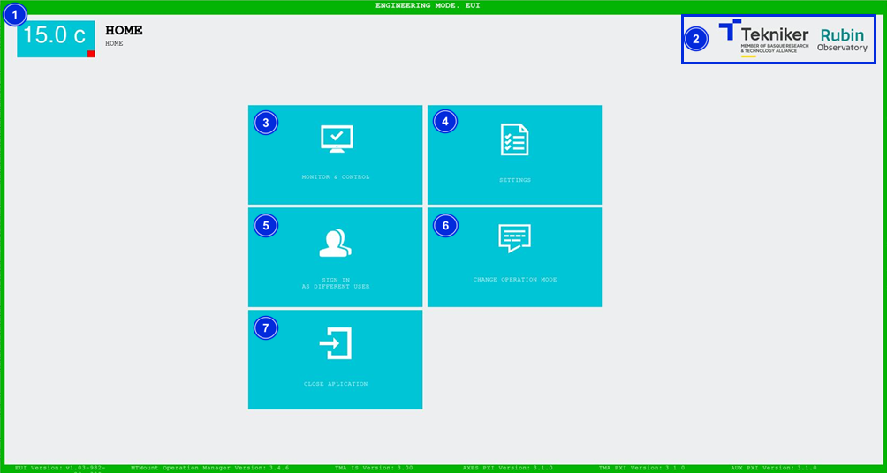

### HOME SCREEN -- HOME

After entering the correct user name and password, you are taken to the "Home" screen.

*Figure 2‑7. Home screen.*

| ITEM| DESCRIPTION|
|----------|----------|
| 1| Displays the telescope’s temperature in real time.|
| 2| Tekniker and Rubin logos.|
| 3| Gives access to the "Monitor and Control" section. The first window loaded will be the ["Monitor General View"](../02_Monitor&Control/000_MonitorGeneralView.md)|
| 4| Gives access to the "Settings" section. The first window loaded will be ["Azimuth Cable Wrap Settings"](../03_Settings/001_AzimuthCableWrapSettings.md)|
| 5| Accesses the ["Log In”](./00_Preliminary_Considerations.md) screen|
| 6| Accesses the screen ["Change Operation Mode"](./02_Change_Of_Operating_Mode.md)|
| 7| Closes the application, [see](../05_ClosingTheApplication/000_Introduction.md)|
