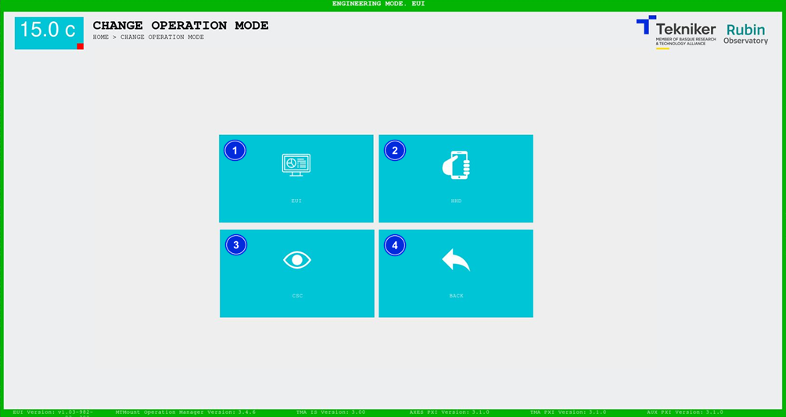
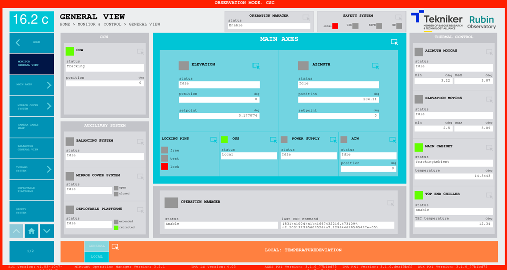

### CHANGE OF OPERATING MODE

This screen is used to change the control mode. If provides a choice between three possible operating modes mentioned in
[prior considerations](00_Preliminary_Considerations.md).

The screen frame will be green if the master/commander corresponds to the device being used. The frame will be displayed in red in all other devices.

For example, if the master is the EUI, it will have the green screen frame, while the HHD will have the red frame.

> ℹ️ As long as the master is the HHD, no other device can request the command until the HHD disconnects or hands over the command to another device.

*Figure 2‑8. Change of operating mode screen.*

| ITEM| DESCRIPTION|
|----------|----------|
| 1| Switches the control mode to EUI and returns to the ["HOME"](./01_Home_Screen_Home.md) screen|
| 2| Switches the control mode to HHD and returns to the ["HOME"](./01_Home_Screen_Home.md) screen|
| 3| Switches the control mode to CSC and returns to the ["HOME"](./01_Home_Screen_Home.md) screen|
| 4| Return to the previous screen ["HOME"](./01_Home_Screen_Home.md)|

The following figure shows an example of a screen in CSC operating mode, i.e. which doesn’t have command and therefore has a red frame.

*Figure 2‑9. Screen with red frame.*
