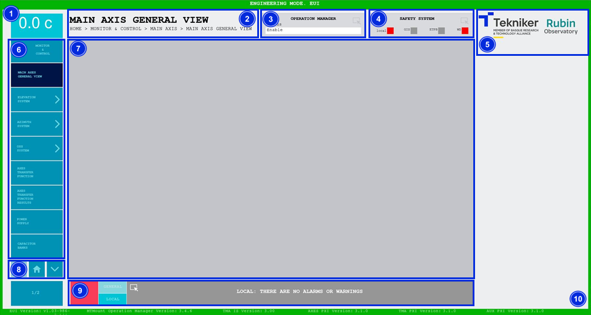

### COMMON ELEMENTS SCREEN

The following figure shows the elements common to all the "Monitor \& Control" screens, as well as all the "Settings" screens.

*Figure 2‑10. Common elements screen.*

<table class="table">
  <thead>
    <tr class="header">
      <th>
ITEM
</th>
      <th>
DESCRIPTION
</th>
    </tr>
  </thead>
  <tbody>
    <tr class="odd">
      <td>
1
</td>
      <td>
Displays the telescope temperature in real time.
</td>
    </tr>
    <tr class="even">
      <td>
2
</td>
      <td>
Displays the title of the screen and its corresponding path
</td>.
    </tr>
    <tr class="odd">
      <td>
3
</td>
      <td>
        

          Accesses the screen <a href="../02_Monitor&Control/035_OperationManager.html">“Operation Manager”</a>
        

        

          Shows the statuses of the “Operation Manager”, <a href="./03_Common_Elements_Screen.html#statuses">see</a>
        

      </td>
    </tr>
    <tr class="even">
      <td>
4
</td>
      <td>
        

          Accesses the screen <a href="../02_Monitor&Control/034_SafetySystem.html">“Safety System”</a>
          Shows four safety system signals:
        

        <ul>
          <li>
            

              Location: It lights up when there is a safety interlock that
              affects the current window's system and does not allow the
              system to operate.
            

          </li>
          <li>
            

              GIS: It lights up when an interlock comes from
              GIS, whether or not it affects the current window system.
            

          </li>
          <li>
            

              ETPB: Lights up when an emergency pushbutton has been pressed.
            

          </li>
          <li>
            

              WD: It lights up when the safety system detects a
              “watchdog” fault.
            

          </li>
        </ul>
      </td>
    </tr>
    <tr class="odd">
      <td>
5
</td>
      <td>
Tekniker and Rubin logos.
</td>
    </tr>
    <tr class="even">
      <td>
6
</td>
      <td>
        

          Menu with access to screens, which changes depending on the window
          where the user is located.
        

        
This section is hidden while a command is executed.

      </td>
    </tr>
    <tr class="odd">
      <td>
7
</td>
      <td>
Space for monitoring and control windows.
</td>
    </tr>
    <tr class="even">
      <td>
8
</td>
      <td>
        
The arrows allow you to scroll up and down in the window menu.

        

          The centre softkey allows you to return to the <a href="./01_Home_Screen_Home.html">“Home”</a>
        

      </td>
    </tr>
    <tr class="odd">
      <td>
9
</td>
      <td>
        

          Accesses the screen <a href="../02_Monitor%26Control/036_AlarmHistory.html">“Alarm History”</a>
        

        

          “GENERAL” softkey: accesses all alarms without filter.
        

        

          Softkey “LOCAL”: filters the alarms and with access only for those
          relating to the subsystem, if within a subsystem.
        

      </td>
    </tr>
    <tr class="even">
      <td>
10
</td>
      <td>
        

          Mark on the screen, its color changes depending on the operating mode,
          <a href="./02_Change_Of_Operating_Mode.html">“see”</a>
        

      </td>
    </tr>
  </tbody>
</table>

#### Statuses

There are multiple different statuses in the application, and all of them are accompanied by a representative color.
This section explains the three most common ones with their respective colors:

- **Grey**: Means that the system is off. This status is known as "Idle".

- **Green**: Means that the system is on. This system is called "Enable".

- **Red**: Means that the system has a fault. This status is given the name “Fault”, but it can also be accompanied by
  the name of the fault itself.
