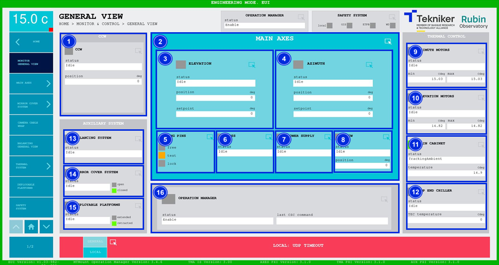

### MONITOR \& CONTROL

#### Monitor General View Screen

This screen shows the main systems and their respective statuses. Each box accesses the corresponding screen.

*Figure 2‑11. Monitor general view screen.*

| ITEM | DESCRIPTION                                                                                                                                                                  |
| ---- | ---------------------------------------------------------------------------------------------------------------------------------------------------------------------------- |
| 1    | Accesses the screen [“Camera Cable Wrap”](./023_CameraCableWrap.md) Displays the status and position (in deg) of “Camera Cable Wrap”.                                        |
| 2    | Accesses the screen [“Main Axis General View”](./001_MainAxisGeneralView.md)                                                                                                 |
| 3    | Accesses the screen [“Elevation General View”](./002_ElevationGeneralView.md) Displays the “Elevation” status, the position (in deg) and the setpoint (in deg).              |
| 4    | Accesses the screen [“Azimuth General View”](./005_AzimuthGeneralView.md) Displays the “Azimuth” status and position (in deg) and setpoint (in deg).                         |
| 5    | Accesses the screen [“Locking Pins”](./004_LockingPins.md) Displays whether the pins are free, in test mode or locked.                                                       |
| 6    | Displays the status and accesses the screen [“OSS General View”](./008_OSSGeneralView.md)                                                                                    |
| 7    | Displays the status and accesses the screen of [“Power Supply”](./018_PowerSupply.md)                                                                                        |
| 8    | Accesses the screen [“Azimuth Cable Wrap”](./006_AzimuthCableWrap.md) Displays the status and position (in deg) of the “Azimuth Cable Wrap (ACW)”.                           |
| 9    | Accesses the screen [“Azimuth Motors”](./026_AzimuthDrivesThermal.md) Displays the status and the maximum and minimum limits (in ºC) of the “Azimuth Motors”.                |
| 10   | Accesses the screen [“Elevation Motors”](./027_ElevationDrivesThermal.md) Displays the status and the maximum and minimum limits (in ºC) of the “Elevation Motors”.          |
| 11   | Accesses the screen [“Main Cabinet”](./028_MainCabinet.md) Displays the status and temperature (in ºC) of the “Main Cabinet”.                                                |
| 12   | Accesses the screen [“Top End Chiller General View”](./029_TopEndChillerGeneralView.md) Displays the status and temperature (in ºC) of the “Top End Chiller”.                |
| 13   | Displays the status and allows access to the screen [“Balancing General View”](./024_BalancingGeneralView.md)                                                                |
| 14   | Accesses the screen [“Mirror Cover General View”](./021_MirrorCoverGeneralView.md) Displays the status of the “Mirror Cover System” and whether it is deployed or retracted. |
| 15   | Accesses the screen [“Deployable Platforms”](./033_DeployablePlatforms.md) Displays the status of the “Deployable Platforms” and whether they are extended or retracted.     |
| 16   | Accesses the screen [“Operation Manager”](./035_OperationManager.md) Displays the status of the “Operation Manager” and the last command.                                    |
