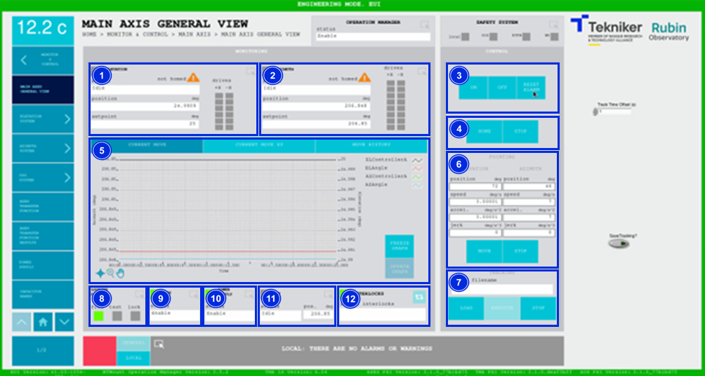
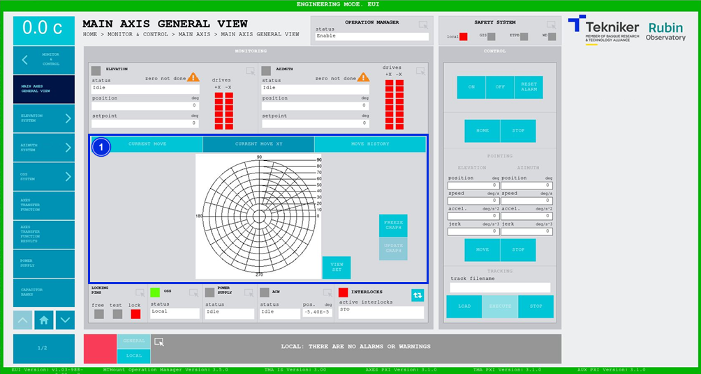
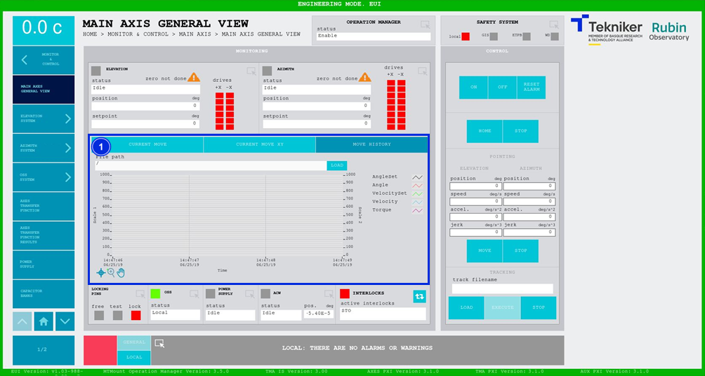
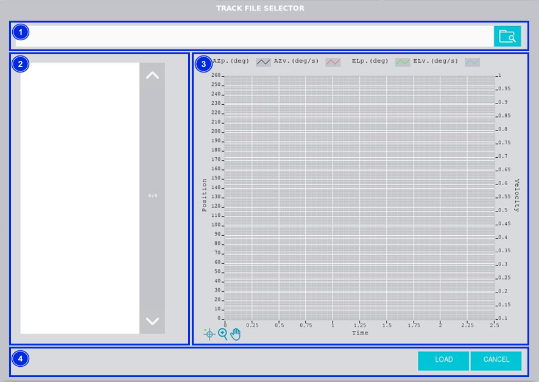

#### Main Axis General View Screen

##### Main Axis General View Screen -- Current Move

This screen allows the azimuth and elevation axes to be commanded at the same time.

> ℹ️ The screen does not allow new operations until both axes complete the previously requested operation.

*Figure 2‑12. Main axis general view screen - current move.*

<table>
<colgroup>
<col style="width: 13%" />
<col style="width: 86%" />
</colgroup>
<thead>
<tr class="header">
<th>ITEM</th>
<th>DESCRIPTION</th>
</tr>
</thead>
<tbody>
<tr class="odd">
<td>1</td>
<td>
Accesses the screen <a href="./002_ElevationGeneralView.md">Elevation General View</a>

Displays the “Elevation” status, position (in deg) and the setpoint (in deg).

Displays the status of each motor by coloured boxes:

<ul>
<li>
Red: Means that the axis has a fault.
</li>
<li>
Green: Means that the axis is on.
</li>
<li>
Grey: Means that the axis is not on.
</li>
</ul>

The orange triangle with the text "not homed" means that the axis reference has not been made.
</td>
</tr>
<tr class="even">
<td>2</td>
<td>
Accesses the screen <a href="./005_AzimuthGeneralView.md">Azimuth General View</a>

Displays the “Azimuth” status, position (in deg) and setpoint (in deg).

Displays the status of each motor by coloured boxes:

<ul>
<li>
Red: Means that the axis has a fault.
</li>
<li>
Green: Means that the axis is on.
</li>
<li>
Grey: Means that the axis is not on.
</li>
</ul>

The orange triangle with the text "not homed" means that the axis reference has not been made.
</td>
</tr>
<tr class="odd">
<td>3</td>
<td>
Softkey “ON”: Switches on both axes, provided that they are in “Idle” and no interlock is
active. The active interlocks are shown in item 12 of this same table.

Softkey “OFF”: Turns off both axes.

Softkey “RESET ALARM”: Resets the alarm status for both axes or resets the interlocks if there are
any.
</td>
</tr>
<tr class="even">
<td>4</td>
<td>
Softkey “HOME”: Runs a search for the axis reference.

Softkey “STOP”: Stops the movement of the axes. This options is permitted provided that a movement
is being executed, without having to wait for it to finish. This is the only operation that is permitted when there movement
operation in progress.
</td>
</tr>
<tr class="odd">
<td>5</td>
<td>
Displays the azimuth and elevation graph is real time.

Softkey “FREEZE GRAPH”: Freezes the graph.

Softkey “UPDATE GRAPH”: Allows the graph to be updated after being frozen.
</td>
</tr>
<tr class="even">
<td>6</td>
<td>
Defines the position (in deg), speed (in deg/s), acceleration (in
deg/s2) and jerk (in deg/s3) specifications for elevation or azimuth, to make a movement.

Softkey “MOVE”: Used to move the axes according to the previously entered specifications.

Softkey “STOP”: Stop the movement of the axes.
</td>
</tr>
<tr class="odd">
<td>7</td>
<td>
Softkey “LOAD”: accesses the fixed trajectory files selection window, [see](#tracking-screen).

Softkey “EXECUTE”: When selected, executes a file.

Softkey “STOP”: Stop the movement of the axes.
</td>
</tr>
<tr class="even">
<td>8</td>
<td>
Accesses the screen <a href="./004_LockingPins.md">Locking Pins General View</a>

Displays the status of the locking pins and turns on the LED with the corresponding colour:

<ul>
<li>
“FREE”: Means that the locking pins are free and lights up in green.
</li>
<li>
“TEST”: Means that the pins are being tested, and lights up orange.
</li>
<li>
“LOCK”: Means that the pins are locked, and lights up red.
</li>
</ul></td>
</tr>
<tr class="odd">
<td>9</td>
<td>Displays the status and accesses the screen <a href="./008_OSSGeneralView.md">OSS General View</a></td>
</tr>
<tr class="even">
<td>10</td>
<td>Displays the status and accesses the screen <a href="./018_PowerSupply.md">Power Supply General View</a></td>
</tr>
<tr class="odd">
<td>11</td>
<td>
Accesses the screen <a href="./006_AzimuthCableWrap.md">Azimuth Cable Wrap</a>

Displays the status and position (in deg) of the “Azimuth Cable Wrap (ACW)”.
</td>
</tr>
<tr class="even">
<td>12</td>
<td>
The blue softkey navigates between the active interlocks, if there is more than one.

When an interlock is active, the top box is displayed in red. If no interlocks are active, the
box will be green and the blue softkey cannot be pressed.
</td>
</tr>
</tbody>
</table>

##### Main Axis General View Screen -- Current Move XY

This screen allows the azimuth and elevation axes to be commanded at the same time, represented on the X and Y axes.

*Figure 2‑13. Main axis general view screen - current move XY.*

<table>
<colgroup>
<col style="width: 13%" />
<col style="width: 86%" />
</colgroup>
<thead>
<tr class="header">
<th>ITEM</th>
<th>DESCRIPTION</th>
</tr>
</thead>
<tbody>
<tr class="odd">
<td>1</td>
<td>
Shows the azimuth and elevation graph, representing the X and Y axes in real time.

Softkey “FREEZE GRAPH”: Freezes the graph.

Softkey “UPDATE GRAPH”: Allows the graph to be updated after being frozen.
</td>
</tr>
</tbody>
</table>

##### Main Axis General View Screen -- Move History

This screen displays and loads the last five azimuth and elevation movements, with number 1 being the last.

*Figure 2‑14. Main axis general view screen - move history.*

<table>
<colgroup>
<col style="width: 13%" />
<col style="width: 86%" />
</colgroup>
<thead>
<tr class="header">
<th>ITEM</th>
<th>DESCRIPTION</th>
</tr>
</thead>
<tbody>
<tr class="odd">
<td>1</td>
<td>
Softkey “LOAD”: Loads the last five movements.

Once the desired movement has been selected, it allows it to be displayed on the graph.
</td>
</tr>
</tbody>
</table>

###### Tracking Screen

This screen is displayed as a “Popup” by clicking on the "LOAD" button on the "Main Axis General View" screen, allowing a file with a fixed path to be selected. This selected path will be executed by pressing the "EXECUTE" button of the "Main Axis General View” screen.

*Figure 2‑15. Tracking screen.*

<table>
<colgroup>
<col style="width: 13%" />
<col style="width: 86%" />
</colgroup>
<thead>
<tr class="header">
<th>ITEM</th>
<th>DESCRIPTION</th>
</tr>
</thead>
<tbody>
<tr class="odd">
<td>1</td>
<td>Selects the directory of the paths to be loaded.</td>
</tr>
<tr class="even">
<td>2</td>
<td>Displays and allows the selection of the filename to be plotted in item 3 of this table.</td>
</tr>
<tr class="odd">
<td>3</td>
<td>Displays the graph of the selected file.</td>
</tr>
<tr class="even">
<td>4</td>
<td>
Softkey “LOAD”: Loads the previously selected file.

Softkey “CANCEL”: Cancels the action and returns to the previous screen.
</td>
</tr>
</tbody>
</table>
