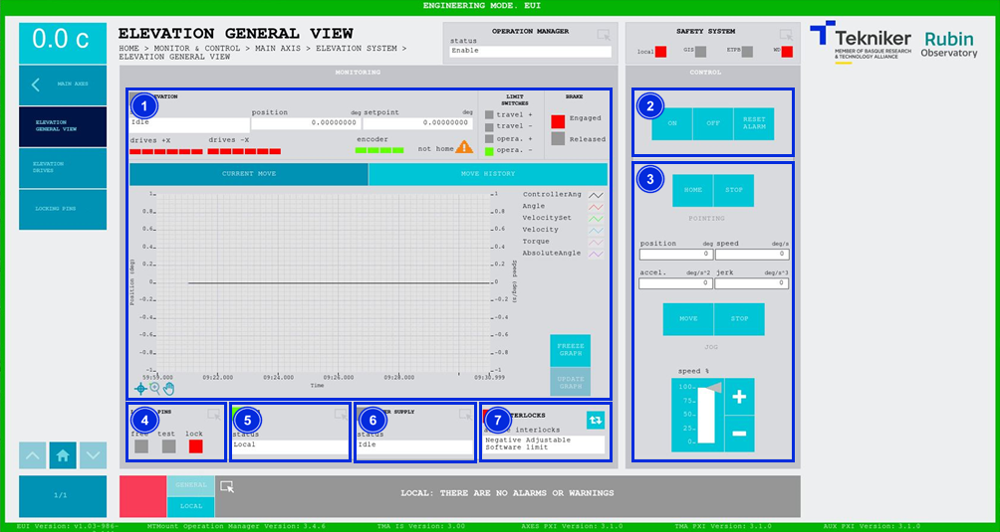
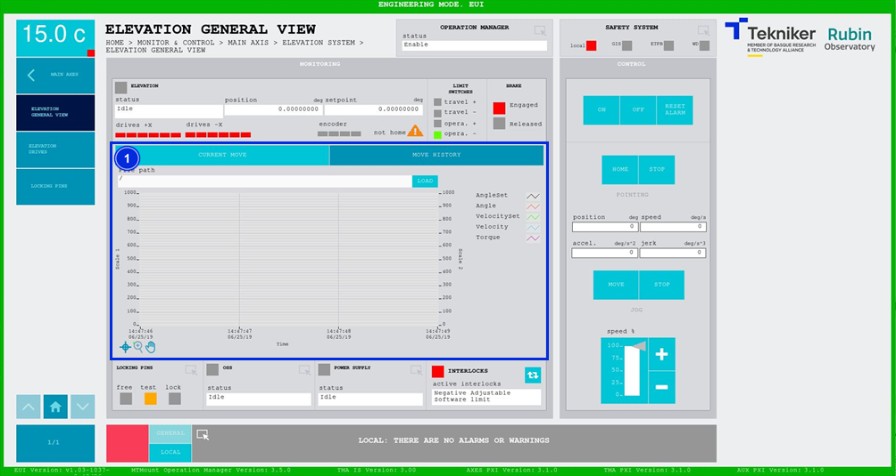

#### Elevation General View Screen

##### Elevation General View Screen -- Current Move

This screen displays the general elevation aspects and enables their control.

*Figure 2‑16. Elevation general view screen - current move.*

<table class="table">
<thead>
<tr class="header">
<th>
ITEM
</th>
<th>
DESCRIPTION
</th>
</tr>
</thead>
<tbody>
<tr class="odd">
<td>
1
</td>
<td>
Displays the elevation status, the position (in deg) and the setpoint (in deg).

Displays the status of each elevation drive and the encoder:

<ul>
<li>
Red: Means that a fault is present.
</li>
<li>
Green: Means that it is on.
</li>
<li>
Grey: Means that it is off.
</li>
</ul>

The orange triangle with the text "not homed" means that the axis reference has not been made.
>

Displays the status of the travel limits. With the most restrictive travel limits being “opera. +” and “opera.
–”, and the full travel limits being “travel +” and “travel –”. The box corresponding to the activated limit
lights up green.

Shows whether or not the brake is applied. The “Engaged” option is represented by a red box when it is, or
“Released” in a green box when it is not.

Displays a graph showing the position and speed in real time.

Softkey “FREEZE GRAPH”: freezes the graph.

Softkey “UPDATE GRAPH”: updates the graph after it has been frozen.
</td>
</tr>
<tr class="even">
<td>
2
</td>
<td>
Softkey “ON”: Only turns on the axis if it is in “Idle” and no interlocks are active.

Softkey “OFF”: Turns off the axis.

Softkey “RESET ALARM”: Resets the system from its current alarm state or resets the
interlock, if any, while in “Idle” to turn “ON”.
</td>
</tr>
<tr class="odd">
<td>
3
</td>
<td>
Defines the position (in deg), speed (in deg/s), acceleration (in deg/s2) and jerk (in
deg/s3) of the elevation.

Softkey “HOME”: Runs a search for the axis reference.

Softkeys “STOP”: Stop the movement of the axes.

Softkey “MOVE”: Used to move the axes according to the previously entered specifications.

Softkeys “+” or “-”: Makes a movement at a constant speed in a positive or negative direction
respectively. This sets the percentage of the default speed defined in the settings with the
vertical slider.
</td>
</tr>
<tr class="even">
<td>
4
</td>
<td>
Accesses the screen <a href="./004_LockingPins.html">Locking Pins General View</a>

Displays the status of the locking pins and turns on the LED with the corresponding color:

<ul>
<li>
“FREE”: Means that the locking pins are free and lights up in green.
</li>
<li>
“TEST”: Means that the pins are being tested, and lights up orange.
</li>
<li>
“LOCK”: Means that the pins are locked, and lights up red.
</li>
</ul></td>
</tr>
<tr class="odd">
<td>
5
</td>
<td>
Displays the status and accesses the screen <a href="./008_OSSGeneralView.html">OSS General View</a>
</td>
</tr>
<tr class="even">
<td>
6
</td>
<td>
Displays the status and accesses the screen <a href="./018_PowerSupply.html">“Power SupplyGeneral View”</a>
</td>
</tr>
<tr class="odd">
<td>
7
</td>
<td>
The blue softkey navigates between the active interlocks, if there is more than one.

When an interlock is active, the top box is displayed in red. If no interlocks are active, the
box will be green and the blue softkey cannot be pressed.
</td>
</tr>
</tbody>
</table>

##### Elevation General View Screen -- Move History

This screen displays and loads the last five elevation movements, with number 1 being the last.

*Figure 2‑17. Elevation general view screen - move history.*

<table class="table">
<thead>
<tr class="header">
<th>
ITEM
</th>
<th>
DESCRIPTION
</th>
</tr>
</thead>
<tbody>
<tr class="odd">
<td>
1
</td>
<td>
Softkey “LOAD”: Loads the last five movements.

Once the desired movement has been selected, it allows it to be displayed on the graph.
</td>
</tr>
</tbody>
</table>
