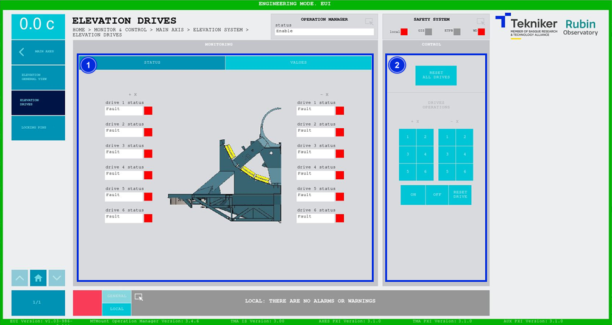
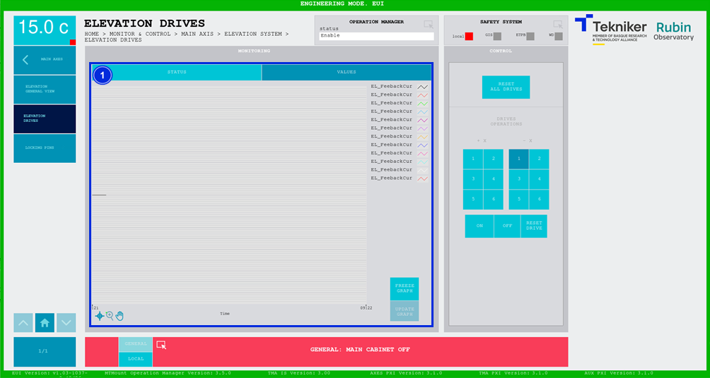

#### Elevation Drives Screen

##### Elevation Drives Screen - Status

This screen displays the statuses and values of the elevation motors and enables their control

*Figure 2‑18. Elevation drives screen - status.*

<table class="table">
<colgroup>
<col style="width: 13%" />
<col style="width: 86%" />
</colgroup>
<thead>
<tr class="header">
<th>
ITEM
</th>
<th>
DESCRIPTION
</th>
</tr>
</thead>
<tbody>
<tr class="odd">
<td>
1
</td>
<td>
Shows the status of the elevation motors. There are three different statuses:

<ul>
<li>
“Disabled”, in grey, means that the motor is off.
</li>
<li>
“Parked”, in grey, means that the motor is disabled and will not start up.
</li>
<li>
“Fault”, in red, means that the motor has a fault.
</li>
<li>
“Enable”, in green, means that the motor is on.
</li>
</ul></td>
</tr>
<tr class="even">
<td>
2
</td>
<td>
Softkey “RESET ALL DRIVES”: resets all motors.

Softkeys “1”, “2”, “3”, “4”, “5” and “6”: select the corresponding motor.

Softkey “ON”: Starts up the previously selected drive.

Softkey “OFF”: Parks the previously selected motor so that it is not enables when the axis is turned on,
it will switch to the status “Parked”.

Softkey “RESET DRIVE”: Resets the previously selected motor.
</td>
</tr>
</tbody>
</table>
##### Elevation Drives Screen - Values

This screen shows a graph with the real time current values of the elevation motors.

*Figure 2‑19. Elevation drives screen - values.*

<table class="table">
<colgroup>
<col style="width: 13%" />
<col style="width: 86%" />
</colgroup>
<thead>
<tr class="header">
<th>
ITEM
</th>
<th>
DESCRIPTION
</th>
</tr>
</thead>
<tbody>
<tr class="odd">
<td>
1
</td>
<td>
Displays a graph with the real time values of the elevation motors.

Softkey “FREEZE GRAPH”: Freezes the graph.

Softkey “UPDATE GRAPH”: Allows the graph to be updated after being frozen.
</td>
</tr>
</tbody>
</table>
