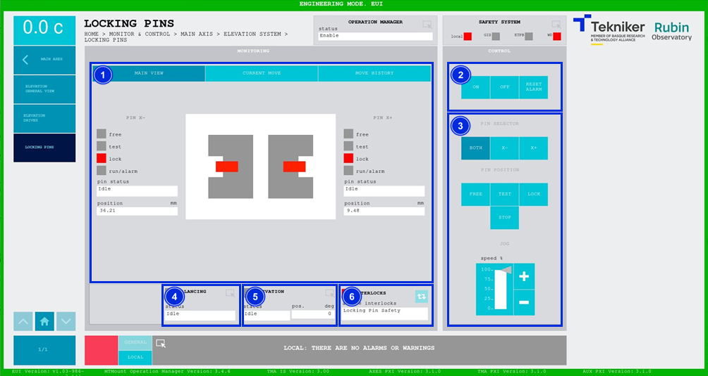
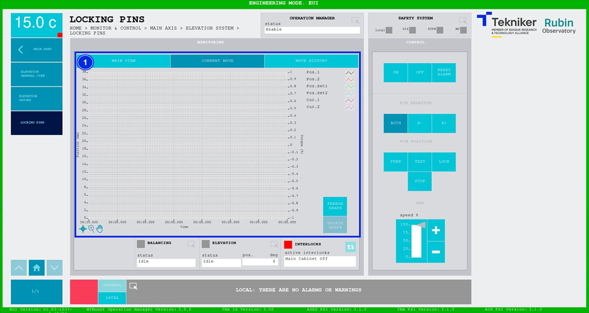
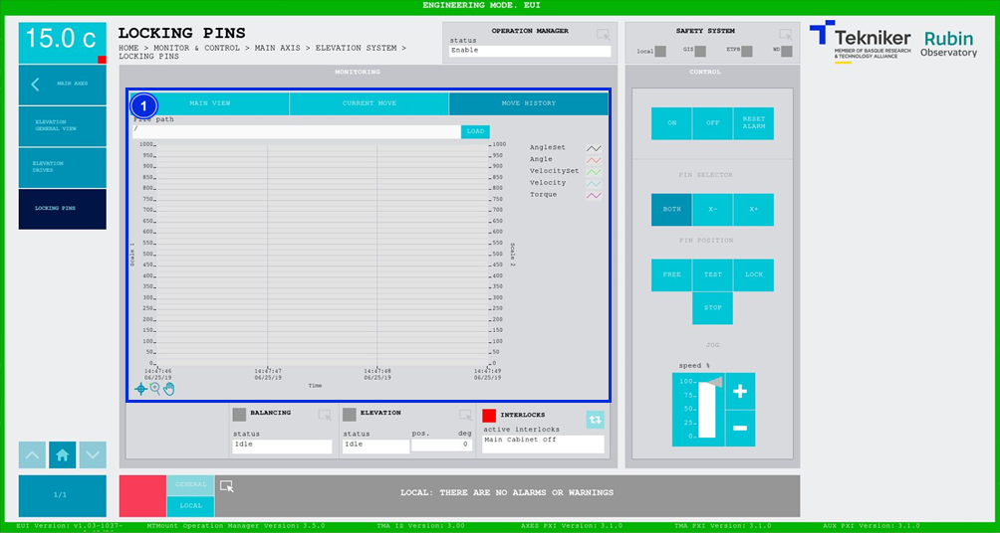

#### Locking Pins Screen

##### Locking Pins Screen -- Main View

This screen displays the elevation axis locking pins and enables their control.

*Figure 2‑20. Locking pins screen - main view.*

<table class="table">
<colgroup>
<col style="width: 13%" />
<col style="width: 86%" />
</colgroup>
<thead>
<tr class="header">
<th>
ITEM
</th>
<th>
DESCRIPTION
</th>
</tr>
</thead>
<tbody>
<tr class="odd">
<td>
1
</td>
<td>
Displays the status of the locking pins:

<ul>
<li>
“Free”, in green. Movement of the elevation shaft is permitted in this position.
</li>
<li>
“Test”, in orange. Fine balancing of the elevation shaft is performed in this position.
</li>
</ul>
<table class="table">
<colgroup>
<col style="width: 10%" />
<col style="width: 89%" />
</colgroup>
<tbody>
<tr class="odd">
<td>⚠️</td>
<td>This position (test) poses a risk to the telescope, as the permitted movements are less than 0.2 deg.</td>
</tr>
</tbody>
</table>
<ul>
<li>
“Lock”, in red, does not allow the elevation movement.
</li>
</ul>

Displays the status and position (in mm) of the locking pins. In addition, the box next to “run/alarm”
lights up in the colour corresponding to the status of the pin.
</td>
</tr>
<tr class="even">
<td>
2
</td>
<td>
Softkey “ON”: Only turns on the pin if it is in “Idle” and no interlock is active.

Softkey “OFF”: Turns off the pin.

Softkey “RESET ALARM”: Resets the system from its current alarm state or resets the
interlock if one exists.
</td>
</tr>
<tr class="odd">
<td>
3
</td>
<td>
Softkey “BOTH”: Selects both pins.

Softkey “X-”: Selects the pin located in the “X-” bracket.

Softkey “X+”: Selects the pin located in the “X+” bracket.

Softkey “FREE”: Moves the previously selected pin to the released position.

Softkey “TEST”: Moves the previously selected pin to the test position.

Softkey “LOCK”: Moves the previously selected pin to the lock position.

Softkey “STOP”: Stops the movement of the previously selected pin.

Softkeys “+” or “-”: Makes a movement at a constant speed in a positive or negative direction
respectively. This sets the percentage of the default speed defined in the settings with the
vertical slider.
</td>
</tr>
<tr class="even">
<td>
4
</td>
<td>Displays the status and allows access to the screen [“Balancing General View”](./024_BalancingGeneralView.md)</td>
</tr>
<tr class="odd">
<td>
5
</td>
<td>
Displays the status and position (in deg) of “Elevation”.

Accesses the screen [“Elevation General View”](./002_ElevationGeneralView.md)
</td>
</tr>
<tr class="even">
<td>
6
</td>
<td>
The blue softkey navigates between the active interlocks, if there is more than one.

When an interlock is active, the top box is displayed in red. If no interlocks are active, the
box will be green and the blue softkey cannot be pressed.
</td>
</tr>
</tbody>
</table>
##### Locking Pins Screen -- Current Move

This screen shows a graph of the movement of the locking pins in real time.

*Figure 2‑21. Locking pins screen - current move.*

<table class="table">
<colgroup>
<col style="width: 13%" />
<col style="width: 86%" />
</colgroup>
<thead>
<tr class="header">
<th>
ITEM
</th>
<th>
DESCRIPTION
</th>
</tr>
</thead>
<tbody>
<tr class="odd">
<td>
1
</td>
<td>
Displays a graph of the movement of the locking pins in real time.

Softkey “FREEZE GRAPH”: Freezes the graph.

Softkey “UPDATE GRAPH”: Allows the graph to be updated after being frozen.
</td>
</tr>
</tbody>
</table>
##### Locking Pins Screen -- Move History

This screen displays and loads the last five movements of the locking pins, with number 1 being the last.

*Figure 2‑22. Locking pins screen - move history.*

<table class="table">
<colgroup>
<col style="width: 13%" />
<col style="width: 86%" />
</colgroup>
<thead>
<tr class="header">
<th>
ITEM
</th>
<th>
DESCRIPTION
</th>
</tr>
</thead>
<tbody>
<tr class="odd">
<td>
1
</td>
<td>
Softkey “LOAD”: Loads the last five movements.

Once the desired movement has been selected, it allows it to be displayed on the graph.
</td>
</tr>
</tbody>
</table>
