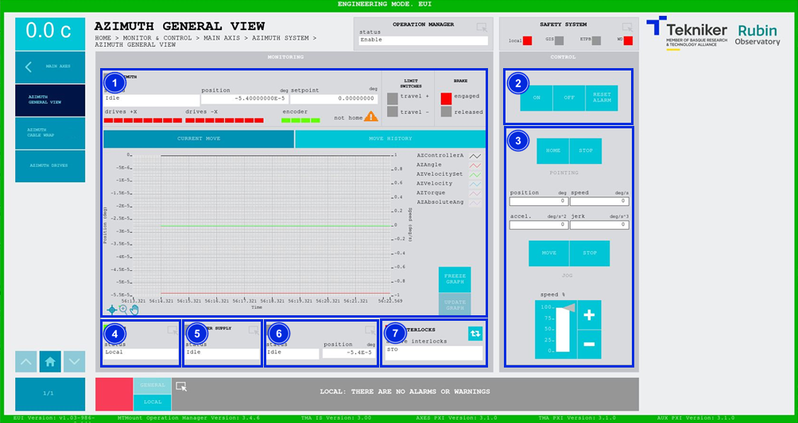
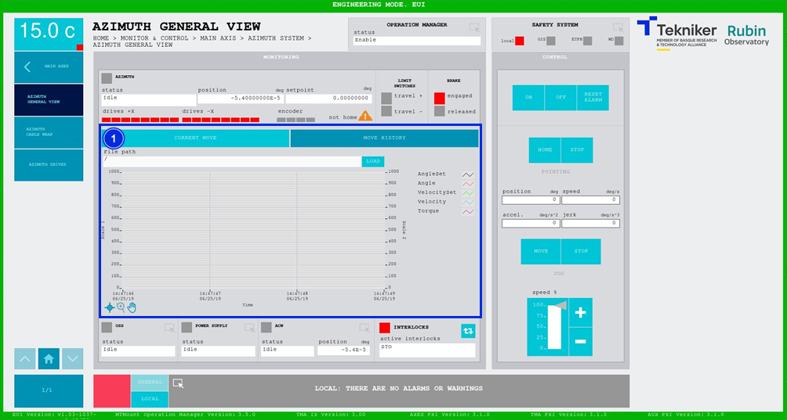

#### Azimuth General View Screen

##### Azimuth General View Screen -- Current Move

This screen displays the general aspects of the azimuth axis and enables their control.

*Figure 2‑23. Azimuth general view screen - current move.*

<table>
<colgroup>
<col style="width: 13<col style="width: 86</colgroup>
<thead>
<tr class="header">
<th>ITEM</th>
<th>DESCRIPTION</th>
</tr>
</thead>
<tbody>
<tr class="odd">
<td>1</td>
<td>
Displays the azimuth status, the position (in deg) and the setpoint (in deg).

Displays the status of each azimuth drive and the encoder:

<ul>
<li>
Red: Means that a fault is present.
</li>
<li>
Green: Means that it is on.
</li>
<li>
Grey: Means that it is off.
</li>
</ul>

The orange triangle with the text "not homed" means that the axis reference has not been made.
>

Displays the status of the travel limits. The box corresponding to the limit that is
green.

Shows whether or not the brake is applied. The “Engaged” option is represented by a red box when it is, or
“Released” in a green box when it is not.

Displays a graph showing the position and speed in real time.

Softkey “FREEZE GRAPH”: Freezes the graph.

Softkey “UPDATE GRAPH”: Allows the graph to be updated after being frozen.
</td>
</tr>
<tr class="even">
<td>2</td>
<td>
Softkey “ON”: Only turns on the axis if it is in “Idle” and no interlocks are active.

Softkey “OFF”: Turns off the axis.

Softkey “RESET ALARM”: Resets the system from its current alarm state or resets the
interlock if one exists.
</td>
</tr>
<tr class="odd">
<td>3</td>
<td>
Defines the position (in deg), speed (in deg/s), acceleration (in deg/s2) and jerk (in
deg/s3) of the azimuth.

Softkey “HOME”: Searches for the axis reference.

Softkeys “STOP”: Stops the movement of the axis.

Softkey “MOVE”: Moves the axis with the previously entered specifications.

Softkeys “+” or “-”: Makes a movement at a constant speed in a positive or negative direction
respectively. This sets the percentage of the default speed defined in the settings with the
vertical slider.
</td>
</tr>
<tr class="even">
<td>4</td>
<td>Displays the status and accesses the screen [“OSS General View”](./008_OSSGeneralView.md)</td>
</tr>
<tr class="odd">
<td>5</td>
<td>Displays the status and accesses the screen [“Power SupplyGeneral View”](./018_PowerSupply.md)</td>
</tr>
<tr class="even">
<td>6</td>
<td>
Accesses the screen [“Azimuth Cable Wrap”](./006_AzimuthCableWrap.md) 2.5.2.3.2.

Displays the status and position (in deg) of the “Azimuth Cable Wrap (ACW)”.
</td>
</tr>
<tr class="odd">
<td>7</td>
<td>
The blue softkey navigates between the active interlocks, if there is more than one.

When an interlock is active, the top box is displayed in red. If no interlocks are active, the
box will be green and the blue softkey cannot be pressed.
</td>
</tr>
</tbody>
</table>
##### Azimuth General View Screen -- Move History

This screen displays and allows the loading of the last five azimuth movements, with number 1 being the last.

*Figure 2‑24. Azimuth general view screen - move history.*

<table>
<colgroup>
<col style="width: 13<col style="width: 86</colgroup>
<thead>
<tr class="header">
<th>ITEM</th>
<th>DESCRIPTION</th>
</tr>
</thead>
<tbody>
<tr class="odd">
<td>1</td>
<td>
Softkey “LOAD”: Loads the last five movements.

Once the desired movement has been selected, it allows it to be displayed on the graph.
</td>
</tr>
</tbody>
</table>
