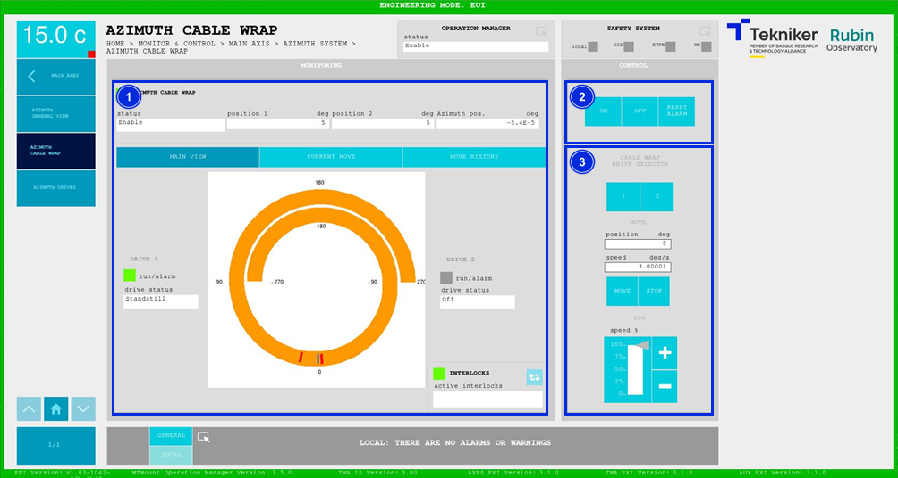
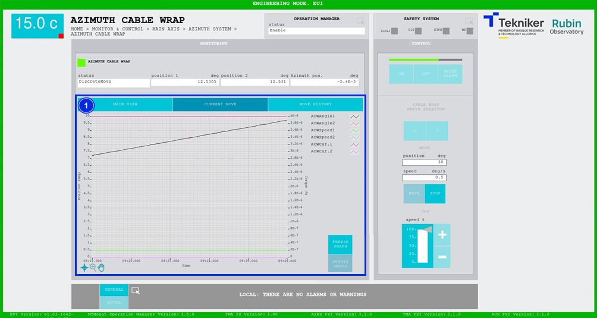
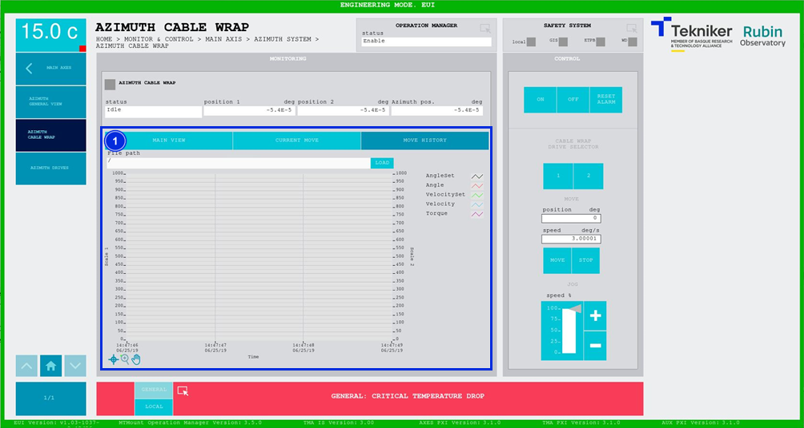

#### Azimuth Cable Wrap Screen

##### Azimuth Cable Wrap Screen -- Main View

This screen displays the status and movement of the "Azimuth Cable Wrap (ACW)” and enables its control.

*Figure 2‑25. Azimuth cable wrap screen - main view.*

<table class="table">
<thead>
<tr class="header">
<th>
ITEM
</th>
<th>
DESCRIPTION
</th>
</tr>
</thead>
<tbody>
<tr class="odd">
<td>
1
</td>
<td>
Displays the status, position 1 (in deg), position 2 (in deg) and the azimuth position (in deg) of the “Azimuth
Cable Wrap (ACW)”.

Position 1 refers to cable wrap motor 1, and position 2 refers to motor 2. The
system will never use both motors at the same time, they are redundant.

Displays the status of each motor. In addition, the box next to “run/alarm” lights up in the colour corresponding to the
motor status.

Displays a chart of the azimuth location (in blue), against the established limits (in red). As
as soon as azimuth approaches one of the limits, the plot is displayed in orange. Otherwise, the plot
is shown in grey.

The blue softkey navigates between the active interlocks, if there is more than one.

When an interlock is active, the top box is displayed in red. If no interlocks are active, the
box will be green and the blue softkey cannot be pressed.
</td>
</tr>
<tr class="even">
<td>
2
</td>
<td>
Softkey “ON”: Only turns on the system if it is in “Idle” and no interlocks are active.

Softkey “OFF”: Turns off the system.

Softkey “RESET ALARM”: Resets the system from its current alarm state or resets the
interlock if one exists.
</td>
</tr>
<tr class="odd">
<td>
3
</td>
<td>
Defines the position (in deg) and the speed (in deg/s) of the “Azimuth Cable Wrap (ACW)”.

Softkeys “1” and “2”: Selects the desired drive.

Softkey “MOVE”: Moves the system, in this case the “Azimuth Cable Wrap (ACW)”.

Softkeys “STOP”: Stop the movement of the system.

Softkeys “+” or “-”: Makes a movement at a constant speed in a positive or negative direction
respectively. This sets the percentage of the default speed defined in the settings with the
vertical slider.
</td>
</tr>
</tbody>
</table>

##### Azimuth Cable Wrap Screen -- Current Move

This screen displays a graph of the “Azimuth Cable Wrap (ACW)” movement in real time.

*Figure 2‑26. Azimuth cable wrap screen - current move.*

<table class="table">
<thead>
<tr class="header">
<th>
ITEM
</th>
<th>
DESCRIPTION
</th>
</tr>
</thead>
<tbody>
<tr class="odd">
<td>
1
</td>
<td>
Displays the graph of the “Azimuth Cable Wrap (ACW)” movement in real time.

Softkey “FREEZE GRAPH”: Freezes the graph.

Softkey “UPDATE GRAPH”: Allows the graph to be updated after being frozen.
</td>
</tr>
</tbody>
</table>

##### Azimuth Cable Wrap Screen -- Move History

This screen displays and loads the last five "Azimuth Cable Wrap (ACW)” movements, with number 1 being the last one.

*Figure 2‑27. Azimuth cable wrap screen - move history.*

<table class="table">
<thead>
<tr class="header">
<th>
ITEM
</th>
<th>
DESCRIPTION
</th>
</tr>
</thead>
<tbody>
<tr class="odd">
<td>
1
</td>
<td>
Softkey “LOAD”: Loads the last five movements.

Once the desired movement has been selected, it allows it to be displayed on the graph.
</td>
</tr>
</tbody>
</table>
