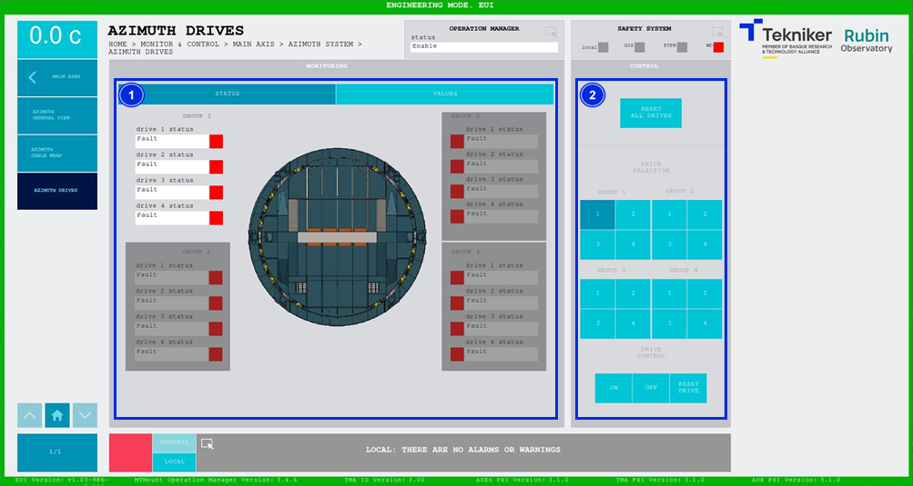
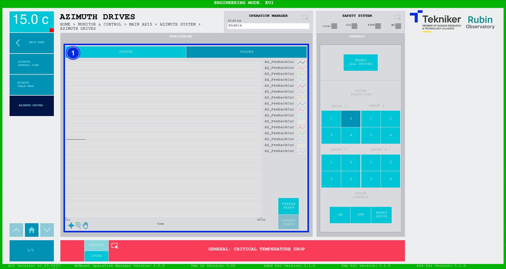

#### Azimuth Drives Screen

##### Azimuth Drives Screen - Status

This screen shows the statuses and values of the azimuth motors and enables their control.

*Figure 2‑28. Azimuth drives - status screen.*

<table>
<colgroup>
<col style="width: 13<col style="width: 86</colgroup>
<thead>
<tr class="header">
<th>ITEM</th>
<th>DESCRIPTION</th>
</tr>
</thead>
<tbody>
<tr class="odd">
<td>1</td>
<td>
Shows the status of the azimuth. There are three different statuses:

<ul>
<li>
“Idle”, in grey, means that the motor is off.
</li>
<li>
“Fault”, in red, means that the motor has a fault.
</li>
<li>
“Parked”, in grey, means that the motor is disabled and will not start up.
</li>
<li>
“Enable”, in green, means that the motor is on.
</li>
</ul></td>
</tr>
<tr class="even">
<td>2</td>
<td>
Softkey “RESET ALL DRIVES”: Resets all drives.

Softkeys “1”, “2”, “3”, and “4”: Selects the desired drives.

Softkey “ON”: Starts up the previously selected drive.

Softkey “OFF”: Parks the previously selected drive so that it is not enables when the axis is turned on,
it will switch to the status “Parked”.

Softkey “RESET DRIVE”: Resets the previously selected motor.
</td>
</tr>
</tbody>
</table>

##### Azimuth Drives Screen - Values

This screen shows a graph with the real time azimuth drive current values.

*Figure 2‑29. Azimuth drives screen - values.*

<table>
<colgroup>
<col style="width: 13<col style="width: 86</colgroup>
<thead>
<tr class="header">
<th>ITEM</th>
<th>DESCRIPTION</th>
</tr>
</thead>
<tbody>
<tr class="odd">
<td>1</td>
<td>
Displays a graph with the real time values of the azimuth drives.

Softkey “FREEZE GRAPH”: Freezes the graph.

Softkey “UPDATE GRAPH”: Allows the graph to be updated after being frozen.
</td>
</tr>
</tbody>
</table>
