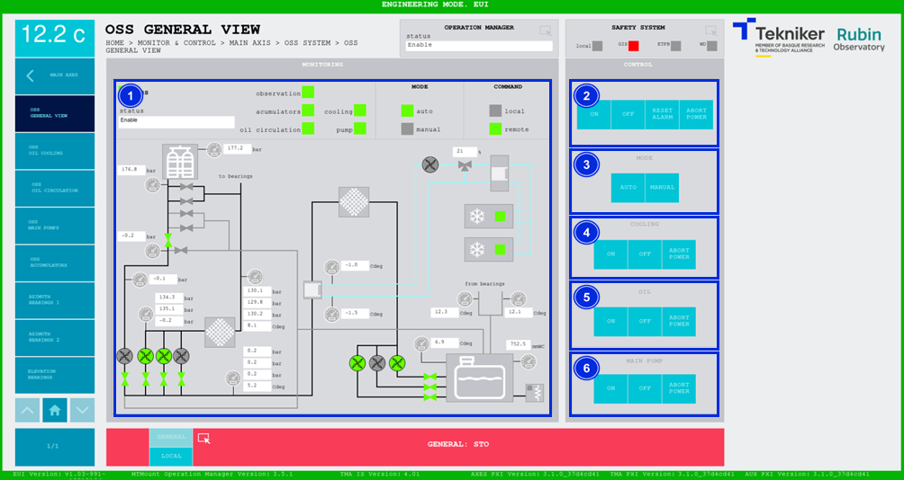
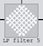
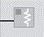

#### OSS General View Screen

This screen displays the general aspects of the "Oil Supply System (OSS)" and enables their control.

*Figure 2‑30. OSS general view screen.*

<table class="table">
<colgroup>
<col style="width: 13<col style="width: 86</colgroup>
<thead>
<tr class="header">
<th>
ITEM
</th>
<th>
DESCRIPTION
</th>
</tr>
</thead>
<tbody>
<tr class="odd">
<td>
1
</td>
<td>
Displays the status of the “Oil Supply System (OSS)” and lights up the upper box in the corresponding colour.

Lights up the LEDs with the colour corresponding to the status of each element. They activate in the following order:
“cooling”, “oil circulation”, “accumulators”, “pump” and “observation”. They can be one of four colours:

<ul>
<li>
Grey: If not active.
</li>
<li>
Green: If active.
</li>
<li>
Red: If they are faulty.
</li>
<li>
Orange: If an interlock is active.
</li>
</ul>

It shows, in green, whether the “Oil Supply System (OSS)” is in manual or automatic mode.

If shows, in green, whether control is local or remote.

Displays the values of the general “Oil Supply System (OSS)” elements and lights up the elements in the
corresponding colour as they are activated:

<ul>
<li>
Grey: If the element is not active.
</li>
<li>
Green: If the element is active.
</li>
<li>
Red: If the element is faulty.
</li>
</ul></td>
</tr>
<tr class="even">
<td>
2
</td>
<td>
The following softkeys can only be used when the system is in automatic and
remote mode.

Softkey “ON”: Only switches on the “Oil Supply System (OSS)” if it is in “Idle”, in “REMOTE+AUTO” and if there is
no active interlock.

Softkey “OFF”: Switches off the “Oil Supply System (OSS)”, while in “REMOTE+AUTO”.

Softkey “RESET ALARM”: Resets the system from its current alarm state or resets the
interlock if one exists.

Softkey “ABORT POWER”: Aborts the power-up of the “Oil Supply System (OSS)”. Once on, it cannot be used to
switch off.
</td>
</tr>
<tr class="odd">
<td>
3
</td>
<td>
Softkey “AUTO”: Operates the “Oil Supply System (OSS)” in automatic mode. All subsystems are turned on
automatically.

Softkey “MANUAL”: Operates the “Oil Supply System (OSS)” in manual mode. Turns on the subsystems
1 by 1.
</td>
</tr>
<tr class="even">
<td>
4
</td>
<td>
The following softkeys can only be used when the system is in manual and remote mode.

Softkey “ON”: Switches cooling on.

Softkey “OFF”: Switches cooling off.

Softkey “ABORT POWER”: Aborts the power-up of cooling. Once on, it cannot be used to
switch off.
</td>
</tr>
<tr class="odd">
<td>
5
</td>
<td>
The following softkeys can only be used when the system is in manual and remote mode.
The cooling must also be on.

Softkey “ON”: Turns on oil circulation.

Softkey “OFF”: Turns off oil circulation.

Softkey “ABORT POWER”: Aborts the power-up of oil circulation. Once on, it cannot be used to
switch off.
</td>
</tr>
<tr class="even">
<td>
6
</td>
<td>
The following softkeys can only be used when the system is in manual and remote mode.
In addition, both cooling and oil circulation must be switched on.

Softkey “ON”: Turns on the main pumps that pump the oil to the telescope.

Softkey “OFF”: Turns off the main pumps.

Softkey “ABORT POWER”: Aborts the power up of the main pumps. Once on, it cannot be used to
switch off.
</td>
</tr>
</tbody>
</table>

##### Icons

The table below shows the main icons present in the following screens, belonging to the OSS, and their respective names.

| icon| name|
|----------|----------|
| | Heat exchanger|
| | Pump|
|  | Valve|
| | Filter|
| | Refrigerator|
| | Pressure gauge|
| | Heater|
| | Bearing|

