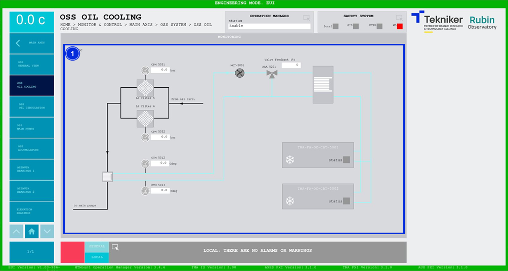

#### OSS Oil Cooling Screen

This screen shows the values of the “Oil Supply System (OSS)” oil cooling system. It is a monitoring screen only.

*Figure 2‑31. OSS oil cooling screen.*

<table>
<colgroup>
<col style="width: 13<col style="width: 86</colgroup>
<thead>
<tr class="header">
<th>ITEM</th>
<th>DESCRIPTION</th>
</tr>
</thead>
<tbody>
<tr class="odd">
<td>1</td>
<td>
Displays the pressures (in bar) and temperatures (in ºC) of the system elements.

Pumps, valves and coolers light up in the colour corresponding to their status:

<ul>
<li>
Grey: If the element is not active.
</li>
<li>
Green: If the element is active.
</li>
<li>
Red: If the element is faulty.
</li>
</ul></td>
</tr>
</tbody>
</table>
