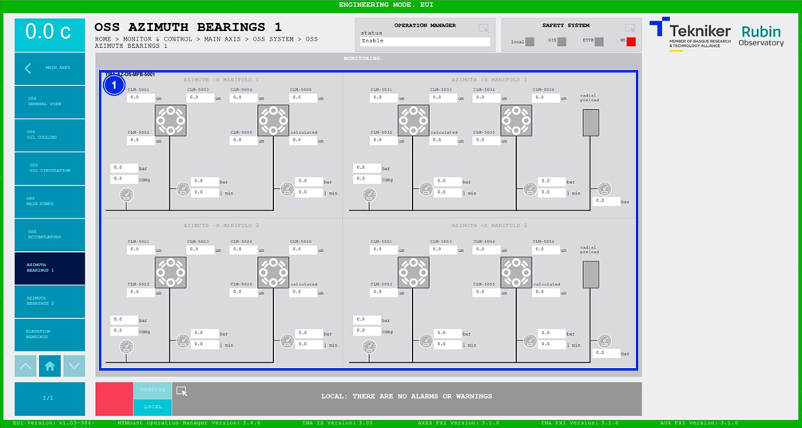

#### OSS Azimuth Bearings 1 screen

This screen shows the values of the first group of "Oil Supply System (OSS)" azimuth bearings. It is a monitoring screen only.

*Figure 2‑35. Azimuth bearings 1 screen.*

| ITEM| DESCRIPTION|
|----------|----------|
| 1| Displays pressures (in bar), flow rates (in l min) and temperatures (in ºC) of the system elements.|
