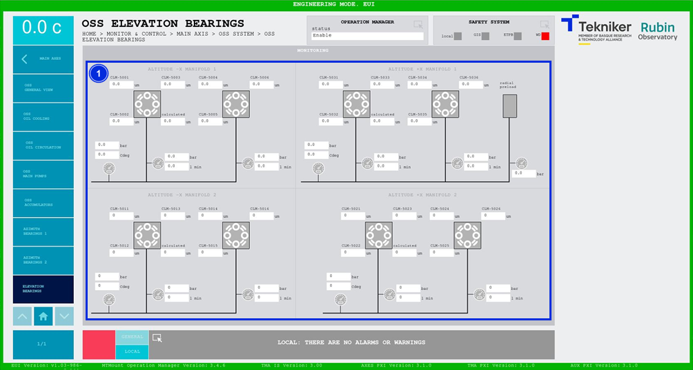

#### OSS Elevation Bearings Screen

This screen shows the values of the elevation bearings of the "Oil Supply System (OSS)". It is a monitoring screen only.

*Figure 2‑37. OSS elevation bearings screen.*

| ITEM| DESCRIPTION|
|----------|----------|
| 1| Displays pressures (in bar), flow rates (in l min) and temperatures (in ºC) of the system elements.|
