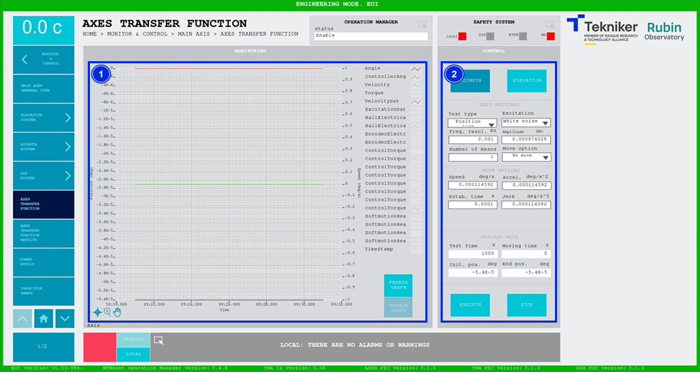

#### Axis Transfer Function Screen

This screen allows the selected axis, Azimuth or Elevation, to be excited, in order to get the transfer function from it and then adjust the corresponding controller.

| WARNING| WARNING|
|----------|----------|
| | **ONLY TO BE USED BY PERSONNEL QUALIFIED FOR THIS TEST.**|

*Figure 2‑38. Axis transfer function screen.*

<table class="table">
<thead>
<tr class="header">
<th>
ITEM
</th>
<th>
DESCRIPTION
</th>
</tr>
</thead>
<tbody>
<tr class="odd">
<td>
1
</td>
<td>
Displays a graph with the real-time values relating to the telescope controller.

Softkey “FREEZE GRAPH”: Freezes the graph.

Softkey “UPDATE GRAPH”: Allows the graph to be updated after being frozen.
</td>
</tr>
<tr class="even">
<td>
2
</td>
<td>
Softkey “AZIMUTH”: Selects the azimuth heads. The test will be performed on the
azimuth axis.

Softkey “ELEVATION”: Selects the elevation settings. The test will be performed on the
elevation axis.

Drop-down windows to choose the type of test, excitation and movement option.

Enables manual entry of the resolution values for frequency (in Hz), amplitude (in deg), and number of
averages.

Enables manual entry of the values of speed (in deg/s), acceleration (in deg/s) and acceleration (in deg/s2), stabilisation
time (s) and jerk (deg/s3), when a movement is selected for the test.

Shows the values calculated based on the values specified in the controls above. These are: the
test time (in s), the movement time (in s), the initial position (in deg) and the final position (in deg).

Softkey “EXECUTE”: Executes the test defined in the settings, by exciting the selected axis, Azimuth or
Elevation, and displays the values in real time on the graph.

Softkey “STOP”: Stops the test.
</td>
</tr>
</tbody>
</table>
