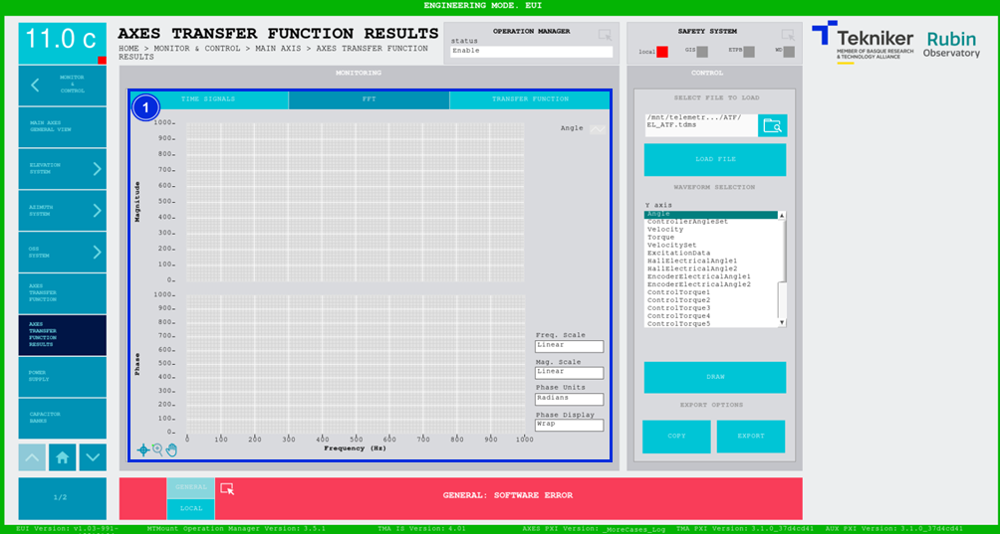
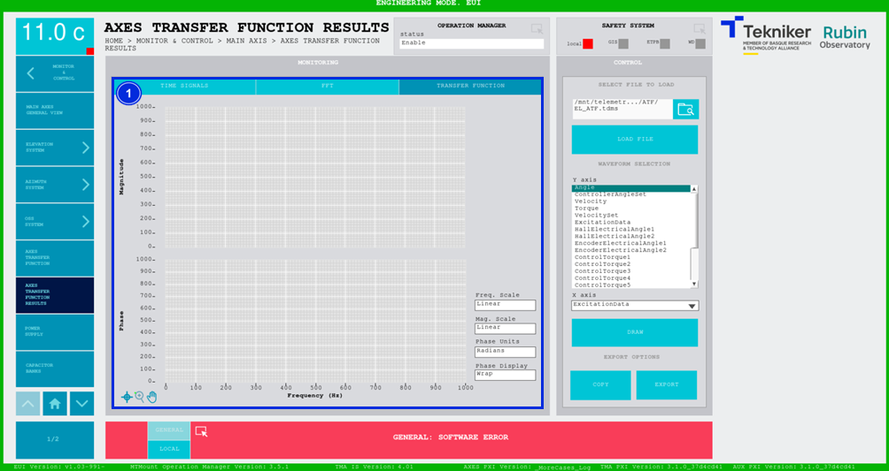

#### Axis Transfer Function Results Screen

This screen displays the signals picked up through the ["Axis Transfer Function"](./016_AxisTransferFunction.md) screen. It allows the results to be analysed for the Azimuth and Elevation axis transfer function.

##### Axis Transfer Function Results Screen -- Time Signals

In this case, it shows the characteristics of the test and data pickup against time.

*Figure 2‑39. Axis transfer function screen - time signals.*

<table>
<colgroup>
<col style="width: 13<col style="width: 86</colgroup>
<thead>
<tr class="header">
<th>ITEM</th>
<th>DESCRIPTION</th>
</tr>
</thead>
<tbody>
<tr class="odd">
<td>1</td>
<td>
Displays the configuration of the loaded test.

Displays the graph of the time signal obtained in the test.
</td>
</tr>
<tr class="even">
<td>2</td>
<td>
Selects a file to display on the graph.

Softkey “LOAD FILE”: Loads the selected file.

Selects one or several signals to be plotted on the Y-axis of the graph.

Softkey “DRAW”: Draws the signals selected from the file.

Softkey “COPY”: Copies the data from the graph.

Softkey “EXPORT”: Exports the data from the graph.
</td>
</tr>
</tbody>
</table>

##### Axis Transfer Function Results Screen -- FFT

This screen displays a FFT graph of the previously selected signals. The result is plotted on two separate graphs of magnitude and phase versus time.

*Figure 2‑40. Axis transfer function screen - FFT.*

<table>
<colgroup>
<col style="width: 13<col style="width: 86</colgroup>
<thead>
<tr class="header">
<th>ITEM</th>
<th>DESCRIPTION</th>
</tr>
</thead>
<tbody>
<tr class="odd">
<td>1</td>
<td>
Displays the graphs of magnitude and phase against frequency (in Hz).

Switches the frequency scale between linear and logarithmic.

Switches the magnitude scale between linear and decibel.

Switches the phase units between sexagesimal degrees and radians.

“Wraps” or “Unwraps”, i.e. represents the phase in values from 0 to 360 (wrap) or not (unwrap).
</td>
</tr>
</tbody>
</table>

##### Axis Transfer Function Results Screen -- Transfer Function

This screen displays a graph of the transfer function of the pre-selected signals. One signal must be selected on the Y-axis, and the other on the X-axis. The result is plotted on two separate graphs of magnitude and phase against time.

*Figure 2‑41. Axis transfer function screen - transfer function.*

<table>
<colgroup>
<col style="width: 13<col style="width: 86</colgroup>
<thead>
<tr class="header">
<th>ITEM</th>
<th>DESCRIPTION</th>
</tr>
</thead>
<tbody>
<tr class="odd">
<td>1</td>
<td>
Displays the graphs of magnitude and phase against frequency (in Hz).

Switches the frequency scale between linear and logarithmic.

Switches the magnitude scale between linear and decibel.

Switches the phase units between sexagesimal degrees and radians.

“Wraps” or “Unwraps” the phase.
</td>
</tr>
</tbody>
</table>
