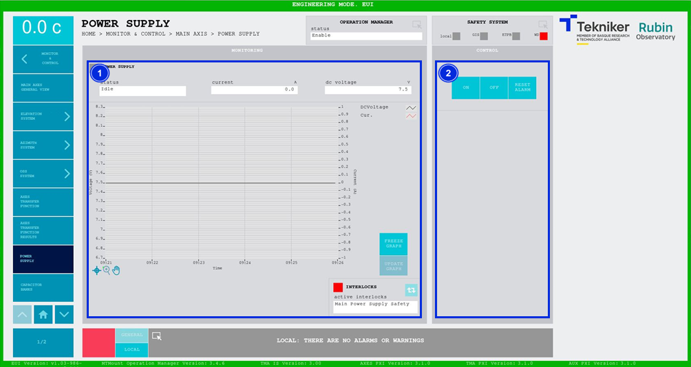

#### Power Supply Screen

This screen displays and allows control of the power supply, which charges the capacitor bank for the Azimuth and Elevation motors.

*Figure 2‑42. Power supply display.*

<table>
<colgroup>
<col style="width: 13<col style="width: 86</colgroup>
<thead>
<tr class="header">
<th>ITEM</th>
<th>DESCRIPTION</th>
</tr>
</thead>
<tbody>
<tr class="odd">
<td>1</td>
<td>
Displays the status, current (in amps) and voltage (in volts) of the power supply. The displayed
values represent the voltage and current of the direct part of the power supply.

Displays the graph of voltage and current against time.

Softkey “FREEZE GRAPH”: Freezes the graph.

Softkey “UPDATE GRAPH”: 
Updates the graph, after it has been frozen.

The blue softkey navigates between the active interlocks, if there is more than one.

When an interlock is active, the top box is displayed in red. If no interlocks are active, the
box will be green and the blue softkey cannot be pressed.
</td>
</tr>
<tr class="even">
<td>2</td>
<td>
Softkey “ON”: Only turns on the power supply if it is in “Idle” and no interlocks are active.

Softkey “OFF”: Turns off the power supply.

Softkey “RESET ALARM”: Resets the system from its current alarm state or resets the
interlock if one exists.
</td>
</tr>
</tbody>
</table>
