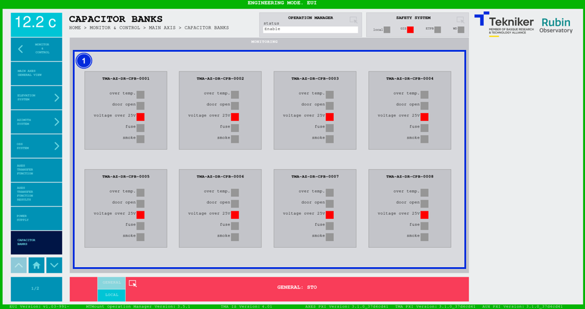

#### Capacitor Banks Screen

This screen shows the status of the capacitor bank cabinets.

*Figure 2‑43. Capacitor banks screen*

<table class="table">
<thead>
<tr class="header">
<th>
ITEM
</th>
<th>
DESCRIPTION
</th>
</tr>
</thead>
<tbody>
<tr class="odd">
<td>
1
</td>
<td>
Displays the statuses of the capacitor bank cabinets. They are greyed out until they are activated. Once
activated they turn red:

<ul>
<li>
“Over temp.”, when the temperature in the cabinet is excessively high.
</li>
<li>
“Door open”, when the door is open.
</li>
<li>
“Voltage over 25 V”, when the voltage is over 25 V.
</li>
<li>
“Fuse”, when a fuse blows.
</li>
<li>
“Smoke”, when smoke is detected inside the cabinet.
</li>
</ul></td>
</tr>
</tbody>
</table>
