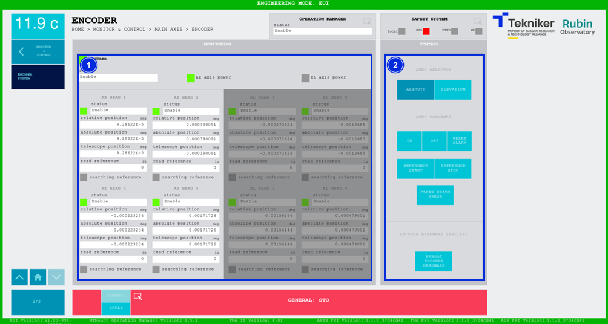

#### Encoder System Screen

This screen displays the statuses of elements of the encoder system for the main axes, Azimuth and Elevation.

*Figure 2‑44. Encoder system screen.*

<table class="table">
<thead>
<tr class="header">
<th>
ITEM
</th>
<th>
DESCRIPTION
</th>
</tr>
</thead>
<tbody>
<tr class="odd">
<td>
1
</td>
<td>
Displays the status of the encoder and each of the azimuth and elevation heads.

For each head it displays: The relative position (in deg), the absolute position (in deg), the position of the telescope (in
deg) and the reference value (in encoder system accounts, this is a value for advanced users who are familiar with the
encoder system).

Each head has a "Searching reference" LED that lights up green when the softkey "REFERENCE"
START” is pressed. If the reference is not found or if the "REFERENCE STOP" softkey is pressed after a certain time,
the system will go into "Fault" status.

It returns to grey automatically after the search is finished or when the “REFERENCE STOP” softkey is pressed.
</td>
</tr>
<tr class="even">
<td>
2
</td>
<td>
Softkey “AZIMUTH”: Selects the azimuth heads.

Softkey “ELEVATION”: Selects the elevation heads.

Softkey “ON”: Only turns on the encoder system if no interlock is active.

Softkey “OFF”: Turns off the encoder system.

Softkey “RESET ALARM”: Resets the system from its current alarm state or resets the
interlock if one exists.

Softkey “REFERENCE START”: Starts the reference search.

Softkey “REFERENCE STOP”: Stops the reference search.

Softkey “CLEAR HEADS ERROR”: Clears errors in the heads.

<table class="table">
<tbody>
<tr class="odd">
<td>🛑</td>
<td>
<b>Only trained personnel should perform this operation.</b>
</td>
<td>
Softkey “REBOOT ENCODER HARDWARE”: Reboots the encoder hardware (EIB).
</td>
</tr>
</tbody>
</table></td>
</tr>
</tbody>
</table>
