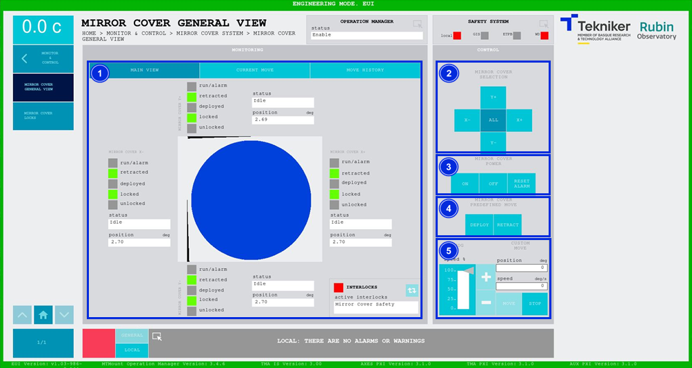
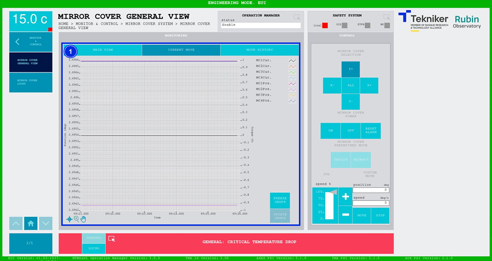
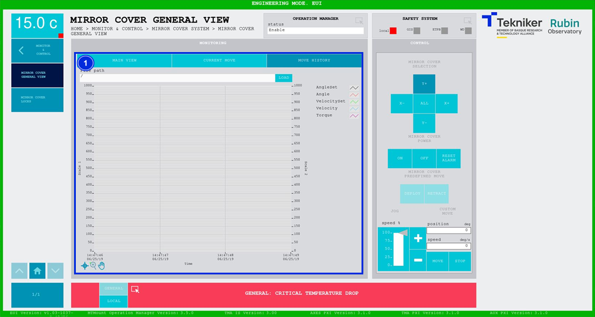

#### Mirror Cover General View screen

##### Mirror Cover General View Screen -- Main View

This screen displays the statuses of the "Mirror Cover” and enables control of their movements.

*Figure 2‑45. Mirror cover general view screen - main view.*

<table>
<colgroup>
<col style="width: 13<col style="width: 86</colgroup>
<thead>
<tr class="header">
<th>ITEM</th>
<th>DESCRIPTION</th>
</tr>
</thead>
<tbody>
<tr class="odd">
<td>1</td>
<td>
Displays the status and position (in deg) of the “Mirror Cover”.

The box next to “run/alarm” lights up in the colour corresponding to the “Mirror Cover” status.

Shows whether the “Mirror Covers” are retracted, deployed, locked or unlocked. The corresponding option
lights up in green.

The blue softkey navigates between the active interlocks, if there is more than one.

When an interlock is active, the top box is displayed in red. If no interlocks are active, the
box will be green and the blue softkey cannot be pressed.
</td>
</tr>
<tr class="even">
<td>2</td>
<td>
Softkeys “Y+”, “X+”, “Y-” and “X-”: Selects the desired “Mirror Cover”.

Softkey “ALL”: Selects all four “Mirror Covers” at the same time.
</td>
</tr>
<tr class="odd">
<td>3</td>
<td>
Softkey “ON”: Turns on the selected “Mirror Cover”, or all if “ALL” is selected, only if in
“Idle” and no interlock is active.

Softkey “OFF”: Turns off the system.

Softkey “RESET ALARM”: Resets the system from its current alarm state or resets the
interlock if one exists.
</td>
</tr>
<tr class="even">
<td>4</td>
<td>
Only available when all axes are selected, softkey “ALL”.

Softkey “DEPLOY”: Deploys all “Mirror Covers”.

Softkey “RETRACT”: Retracts all “Mirror Covers”.
</td>
</tr>
<tr class="odd">
<td>5</td>
<td>
Adjusts the position (in deg) and speed (in deg/s) of the “Mirror Covers”. This is only possible if
they are individually controlled.

Softkeys “+” or “-”: Makes a movement at a constant speed in a positive or negative direction
respectively. This sets the percentage of the default speed defined in the settings with the
vertical slider.

Softkey “MOVE”: Used to move the axes according to the previously entered specifications.

Softkey “STOP”: Stop the movement of the axes.
</td>
</tr>
</tbody>
</table>

###### Mirror Cover Deploy/Retract sequence

<table class="table">
  <thead>
    <tr class="odd">
      <td class="head" style="font-size: 30px;"> ℹ️ </td>
      <td class="head">
        
<strong>REMEMBER</strong>

        

          Before using the Deploy/Retract buttons power on the *Mirror Cover Locks* (MCLs), as these two commands will
          fail if the MCLs are not enabled.
        

      </td>
    </tr>
  </thead>
</table>

- Deploy sequence: this sequence is for extending all Mirror Covers (MCs), which requires the MCLs to be in the unlocked
  position to permit motion. Sequence steps after pressing the Deploy button:
  - All the MCLs are moved to the unlock position
  - When the MCLs reach the unlocked position, two MCs are moved (Y+ and Y-)
  - When the MCs reach the extended position, two MCs are moved (X+ and X-)
  - When the MCs reach the extended position, the command is ended successfully
- Retract sequence: this sequence is for retracting all Mirror Covers (MCs), which requires the MCLs to be in the locked
  position when completed. Sequence steps after pressing the Retract button:
  - Two MCs are moved (X+ and X-)
  - When the MCs reach the retracted position, two MCs are moved (Y+ and Y-)
  - When the MCs reach the retracted position, all the MCLs are moved to the lock position
  - When the MCLs reach the retracted position, the command is ended successfully

For both commands, if during any of the steps of the sequence a fault occurs the motion will be stopped. Sending the command
again, repressing the button, should work and complete the sequence successfully.

> The limit switches indicating the Locked/Unlocked and Deployed/Retracted positions will be turned on when the
> command is complete, but these are very delicate and sometimes are unpressed when elevation is moved.

##### Mirror Cover General View Screen -- Current Move

This screen shows a graph of the movement of the “Mirror Covers” in real time.

*Figure 2‑46. Mirror cover general view screen - current move.*

<table>
<colgroup>
<col style="width: 13<col style="width: 86</colgroup>
<thead>
<tr class="header">
<th>ITEM</th>
<th>DESCRIPTION</th>
</tr>
</thead>
<tbody>
<tr class="odd">
<td>1</td>
<td>
Displays a graph of the movement of the “Mirror Covers” in real time.

Softkey “FREEZE GRAPH”: Freezes the graph.

Softkey “UPDATE GRAPH”: Allows the graph to be updated after being frozen.
</td>
</tr>
</tbody>
</table>

##### Mirror Cover General View Screen -- Move History

This screen displays and loads the last five movements of the “Mirror Covers” with number 1 being the last.

*Figure 2‑47. Mirror cover general view screen - move history.*

<table>
<colgroup>
<col style="width: 13<col style="width: 86</colgroup>
<thead>
<tr class="header">
<th>ITEM</th>
<th>DESCRIPTION</th>
</tr>
</thead>
<tbody>
<tr class="odd">
<td>1</td>
<td>
Softkey “LOAD”: Loads the last five movements.

Once the desired movement has been selected, it allows it to be displayed on the graph.
</td>
</tr>
</tbody>
</table>
