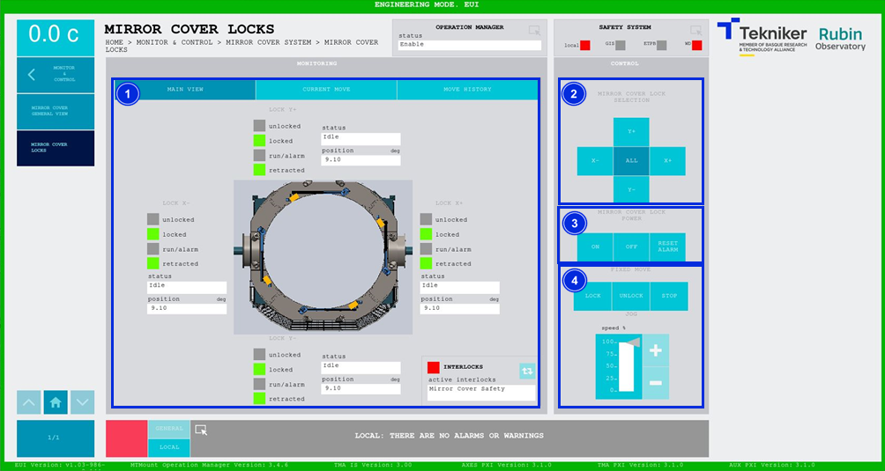
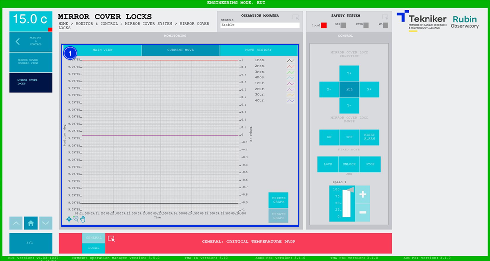
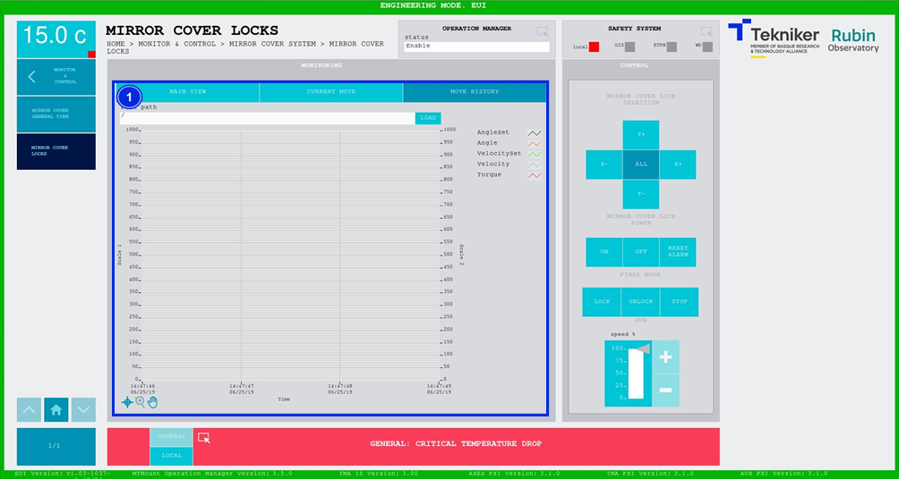

#### Mirror Cover Locks Screen

##### Mirror Cover Locks Screen -- Main View

This screen displays the statuses and movements of the "Mirror Cover Locks” and enables control of their movements.

*Figure 2‑48. Mirror cover locks screen - main view.*

<table class="table">
<colgroup>
<col style="width: 13<col style="width: 86</colgroup>
<thead>
<tr class="header">
<th>
ITEM
</th>
<th>
DESCRIPTION
</th>
</tr>
</thead>
<tbody>
<tr class="odd">
<td>
1
</td>
<td>
Displays the status and position (in deg) of the “Mirror Cover Locks”.

The box next to “run/alarm” lights up in the colour corresponding to the lock status.

Shows whether the “Mirror Covers” are retracted, locked or unlocked. The corresponding option lights
up in green.

Shows the status of each lock in figure:

<ul>
<li>
Orange: Means that the lock is locking the “Mirror Cover”.
</li>
<li>
Red: Means that the lock is in a position that interferes with the correct movement of the “Mirror
Cover”.
</li>
<li>
Green: Means that the lock is fully open and allows the movement of the “Mirror Cover”.
</li>
</ul>

The blue softkey navigates between the active interlocks, if there is more than one.

When an interlock is active, the top box is displayed in red. If no interlocks are active, the
box will be green and the blue softkey cannot be pressed.
</td>
</tr>
<tr class="even">
<td>
2
</td>
<td>
Softkeys “Y+”, “X+”, “Y-” and “X-”: Selects the desired “Mirror Cover”.

Softkey “ALL”: Selects all four “Mirror Covers” at the same time.
</td>
</tr>
<tr class="odd">
<td>
3
</td>
<td>
Softkey “ON”: Only turns on the system if it is in “Idle” and no interlocks are active.

Softkey “OFF”: Turns off the system.

Softkey “RESET ALARM”: Resets the system from its current alarm state or resets the
interlock if one exists.
</td>
</tr>
<tr class="even">
<td>
4
</td>
<td>
Softkey “LOCK”: Locks the “Mirror Cover”.

Softkey “UNLOCK”: Unlocks the “Mirror Cover”.

Softkey “STOP”: Stops the movement.

Softkeys “+” or “-”: Makes a movement at a constant speed in a positive or negative direction
respectively. This sets the percentage of the default speed defined in the settings with the
vertical slider.
</td>
</tr>
</tbody>
</table>

##### Mirror Cover Locks Screen -- Current Move

This screen shows a graph of the movement of the “Mirror Cover Locks” in real time.

*Figure 2‑49. Mirror cover locks screen - current move.*

<table class="table">
<colgroup>
<col style="width: 13<col style="width: 86</colgroup>
<thead>
<tr class="header">
<th>
ITEM
</th>
<th>
DESCRIPTION
</th>
</tr>
</thead>
<tbody>
<tr class="odd">
<td>
1
</td>
<td>
Displays a graph of the movement of the “Mirror Cover Locks” in real time.

Softkey “FREEZE GRAPH”: Freezes the graph.

Softkey “UPDATE GRAPH”: Allows the graph to be updated after being frozen.
</td>
</tr>
</tbody>
</table>

##### Mirror Cover Locks Screen -- Move History

This screen displays and loads the last five movements of the “Mirror Cover Locks” with number 1 being the last.

*Figure 2‑50. Mirror cover locks screen - move history.*

<table class="table">
<colgroup>
<col style="width: 13<col style="width: 86</colgroup>
<thead>
<tr class="header">
<th>
ITEM
</th>
<th>
DESCRIPTION
</th>
</tr>
</thead>
<tbody>
<tr class="odd">
<td>
1
</td>
<td>
Softkey “LOAD”: Loads the last five movements.

Once the desired movement has been selected, it allows it to be displayed on the graph.
</td>
</tr>
</tbody>
</table>
