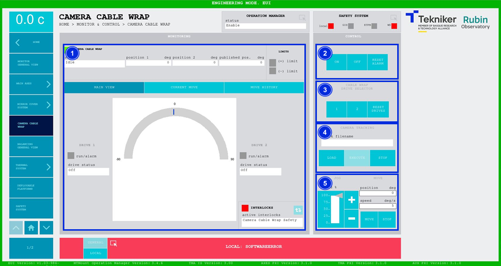
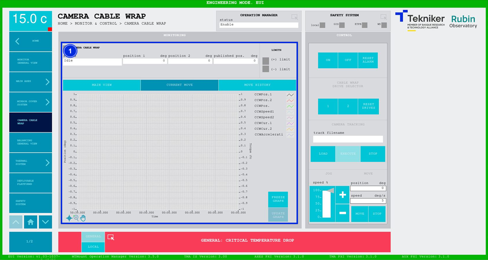
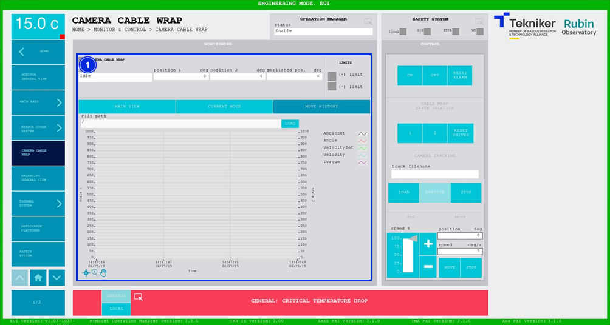

#### Camera Cable Wrap Screen

##### Camera Cable Wrap Screen -- Main View

This screen displays the statuses and movements of the "Camera Cable Wrap” motors and enables their control.

| WARNING| WARNING|
|----------|----------|
| | **THIS ELEMENT MUST NOT BE USED IF THE CAMERA IS CONNECTED, EXCEPT BY STAFF TRAINED IN THE WRAP AND CAMERA CABLE WRAP.**|

*Figure 2‑51. Camera cable wrap screen - main view.*

<table class="table">
<colgroup>
<col style="width: 13<col style="width: 86</colgroup>
<thead>
<tr class="header">
<th>
ITEM
</th>
<th>
DESCRIPTION
</th>
</tr>
</thead>
<tbody>
<tr class="odd">
<td>
1
</td>
<td>
Displays the status, position 1 (in deg), position 2 (in deg) and the published position (in deg) of “Camera
Cable Wrap”.

Displays the status of the travel limits. The box corresponding to the active limit lights up in
green.

Displays the status of the drives. The box next to “run/alarm” lights up in the colour corresponding to the status
of the drive.

The blue softkey navigates between the active interlocks, if there is more than one.

When an interlock is active, the top box is displayed in red. If no interlocks are active, the
box will be green and the blue softkey cannot be pressed.
</td>
</tr>
<tr class="even">
<td>
2
</td>
<td>
Softkey “ON”: Only turns on the system if it is in “Idle” and no interlocks are active.

Softkey “OFF”: Turns off the system.

Softkey “RESET ALARM”: Resets the system from its current alarm state or resets the
interlock if one exists.
</td>
</tr>
<tr class="odd">
<td>
3
</td>
<td>
Softkeys “1” and “2”: Selects the desired drive.

Softkey “RESET DRIVES”: Resets the drives.
</td>
</tr>
<tr class="even">
<td>
4
</td>
<td>Commands a path set by a file, [see](./001_MainAxisGeneralView.md/#pantalla-tracking)</td>
</tr>
<tr class="odd">
<td>
5
</td>
<td>
Adjusts the position (in deg) and speed (in deg/s) of the “Camera Cable Wrap”.

Softkeys “+” or “-”: Makes a movement at a constant speed in a positive or negative direction
respectively. This sets the percentage of the default speed defined in the settings with the
vertical slider.

Softkey “MOVE”: Used to move the axes according to the previously entered specifications.

Softkey “STOP”: Stop the movement of the axes.
</td>
</tr>
</tbody>
</table>

##### Camera Cable Wrap Screen -- Current Move

This screen shows a graph of the real time "Camera Cable Wrap" movement.

*Figure 2‑52. Camera cable wrap screen - current move.*

<table class="table">
<colgroup>
<col style="width: 13<col style="width: 86</colgroup>
<thead>
<tr class="header">
<th>
ITEM
</th>
<th>
DESCRIPTION
</th>
</tr>
</thead>
<tbody>
<tr class="odd">
<td>
1
</td>
<td>
Displays the graph of the real time “Camera Cable Wrap” movement.

Softkey “FREEZE GRAPH”: Freezes the graph.

Softkey “UPDATE GRAPH”: Allows the graph to be updated after being frozen.
</td>
</tr>
</tbody>
</table>

##### Camera Cable Wrap Screen -- Move History

This screen displays and loads the last five "Camera Cable Wrap” movements, with number 1 being the last one.

*Figure 2‑53. Camera cable wrap screen - move history.*

<table class="table">
<colgroup>
<col style="width: 13<col style="width: 86</colgroup>
<thead>
<tr class="header">
<th>
ITEM
</th>
<th>
DESCRIPTION
</th>
</tr>
</thead>
<tbody>
<tr class="odd">
<td>
1
</td>
<td>
Softkey “LOAD”: Loads the last five movements.

Once the desired movement has been selected, it allows it to be displayed on the graph.
</td>
</tr>
</tbody>
</table>
