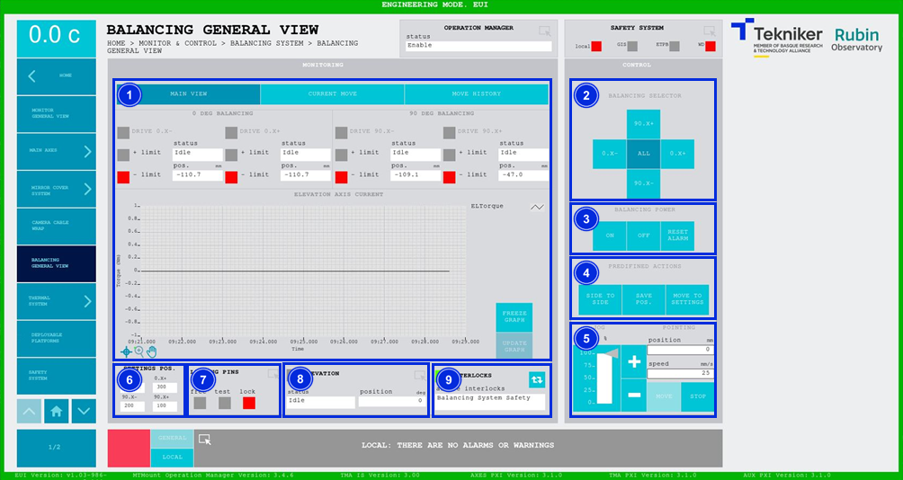
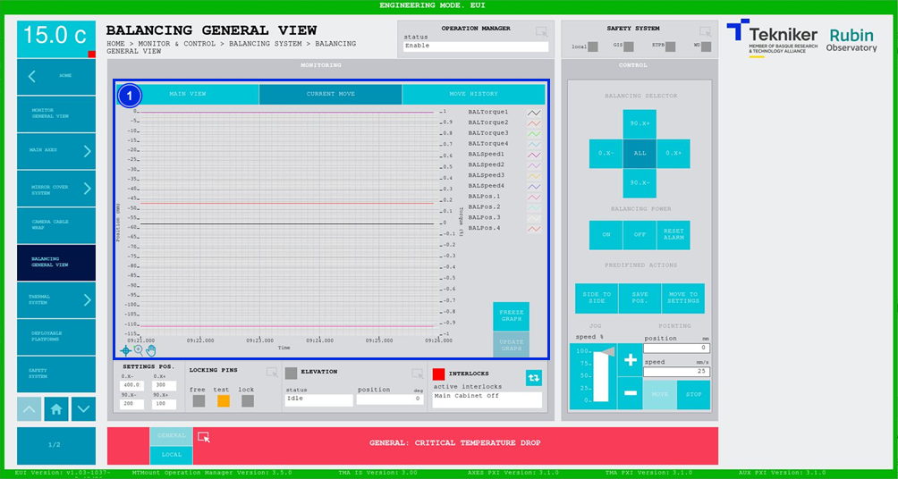
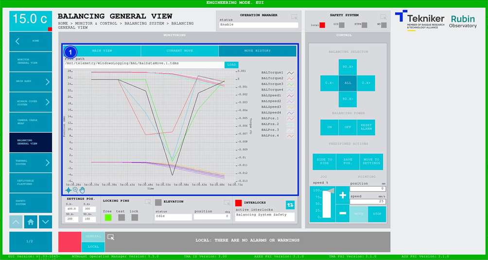

#### Balancing General View Screen

##### Balancing General View Screen -- Main View

This screen displays the statuses and movements of the motors that move the masses used for the fine balancing of the elevation axis, and enables their control.

*Figure 2‑54. Balancing general view screen - main view.*

<table>
<colgroup>
<col style="width: 13<col style="width: 86</colgroup>
<thead>
<tr class="header">
<th>ITEM</th>
<th>DESCRIPTION</th>
</tr>
</thead>
<tbody>
<tr class="odd">
<td>1</td>
<td>
Displays the status and position (in mm) of the motors. The box next to each motor lights up in the colour
corresponding to its status.

Displays the status of the limits of each motor. The box corresponding to the active limit lights up in
green.

Displays the graph with the real time torque of the elevation axis.

Softkey “FREEZE GRAPH”: Freezes the graph.

Softkey “UPDATE GRAPH”: Allows the graph to be updated after being frozen.
</td>
</tr>
<tr class="even">
<td>2</td>
<td>
Softkeys “90 X+”, “0 X+”, “90 X-” and “0 X-“: Select the balancing mass.

Softkey “ALL”: Selects the four balancing masses.
</td>
</tr>
<tr class="odd">
<td>3</td>
<td>
Softkey “ON”: Switches on the selected balancing mass, or all of them, depending on the selection.

Softkey “OFF”: Switches off the selected balancing mass, or all of them, depending on the selection.

Softkey “RESET ALARM”: Resets the selected balancing mass, or all of them, depending on the selection and
resets the interlock if one exists.
</td>
</tr>
<tr class="even">
<td>4</td>
<td>
Only available when all axes are selected at the same time.

Softkey “SIDE TO SIDE”: Moves all masses from side to side and returns them to the starting point. All masses
move one at a time.

Softkey “SAVE POS.”: Saves the current positions in the database.

Softkey “MOVE TO SETTINGS”: Returns to the positions saved in the database. These values are shown
in item 6 of this table.
</td>
</tr>
<tr class="odd">
<td>5</td>
<td>
Adjusts the position (in deg) and speed (in deg/s) of the balancing motor, always
individually.

Softkeys “+” or “-”: Makes a movement at a constant speed in a positive or negative direction
respectively. This sets the percentage of the default speed defined in the settings with the
vertical slider.

Softkey “MOVE”: Used to move the axes according to the previously entered specifications.

Softkey “STOP”: Stop the movement of the axes.
</td>
</tr>
<tr class="even">
<td>6</td>
<td>Displays the values saved in [“Settings”](../03_Settings/012_PantallaBalancingSettings.md).</td>
</tr>
<tr class="odd">
<td>7</td>
<td>
Accesses the screen [“Locking Pins General View”](./004_PantallaLockingPins.md)

Displays the status of the locking pins and turns on the LED with the corresponding colour:

<ul>
<li>
“FREE”: Means that the locking pins are free and lights up in green.
</li>
<li>
“TEST”: Means that the pins are being tested, and lights up orange.
</li>
<li>
“LOCK”: Means that the pins are locked, and lights up red.
</li>
</ul></td>
</tr>
<tr class="even">
<td>8</td>
<td>
Displays the status and position (in deg) of “Elevation”.

Accesses the screen [“Elevation General View”](./002_PantallaElevationGeneralView.md)
</td>
</tr>
<tr class="odd">
<td>9</td>
<td>
The blue softkey navigates between the active interlocks, if there is more than one.

When an interlock is active, the top box is displayed in red. If no interlocks are active, the
box will be green and the blue softkey cannot be pressed.
</td>
</tr>
</tbody>
</table>

##### Balancing General View Screen -- Current Move

This screen shows a graph of the movement of the four masses used to balance the elevation axis, in real time.

*Figure 2‑55. Balancing general view screen - current move.*

<table>
<colgroup>
<col style="width: 13<col style="width: 86</colgroup>
<thead>
<tr class="header">
<th>ITEM</th>
<th>DESCRIPTION</th>
</tr>
</thead>
<tbody>
<tr class="odd">
<td>1</td>
<td>
Shows the graph of the movement of the four masses used to balance the elevation axis, in real
time.

Softkey “FREEZE GRAPH”: Freezes the graph.

Softkey “UPDATE GRAPH”: Allows the graph to be updated after being frozen.
</td>
</tr>
</tbody>
</table>

##### Balancing General View Screen -- Move History

This screen displays and loads the last five movements of the masses used to balance the elevation axis, with number 1 being the last.

*Figure 2‑56. Balancing general view screen - move history.*

<table>
<colgroup>
<col style="width: 13<col style="width: 86</colgroup>
<thead>
<tr class="header">
<th>ITEM</th>
<th>DESCRIPTION</th>
</tr>
</thead>
<tbody>
<tr class="odd">
<td>1</td>
<td>
Softkey “LOAD”: Loads the last five movements.

Once the desired movement has been selected, it allows it to be displayed on the graph.
</td>
</tr>
</tbody>
</table>
