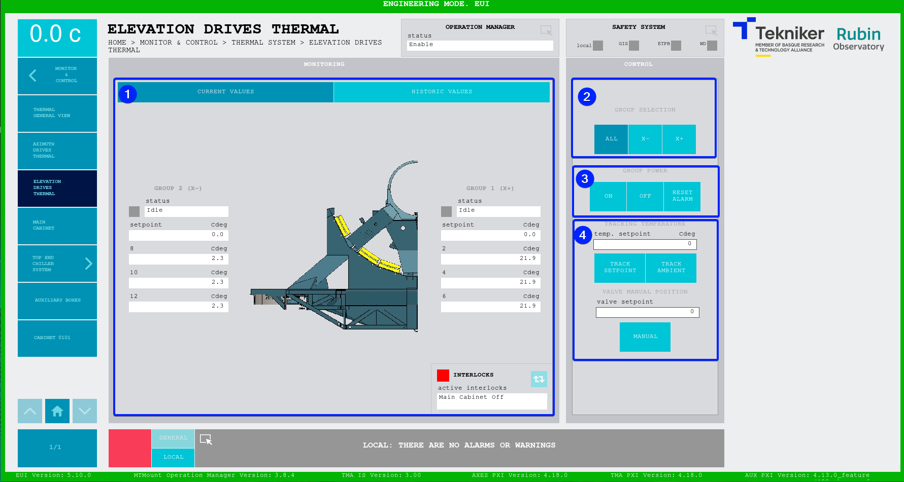

#### Elevation Drives Thermal Screen

##### Elevation Drives Thermal Screen -- Current Values

This screen shows the temperatures of the elevation drives and enables their control.

*Figure 2‑60. Elevation drives thermal screen - current values.*

<table class="table">
<colgroup>
<col style="width: 13<col style="width: 86</colgroup>
<thead>
<tr class="header">
<th>
ITEM
</th>
<th>
DESCRIPTION
</th>
</tr>
</thead>
<tbody>
<tr class="odd">
<td>
1
</td>
<td>
Shows the status, the setpoint (in ºC) and the temperatures (in ºC) in the elevation drives.

The blue softkey navigates between the active interlocks, if there is more than one.

When an interlock is active, the top box is displayed in red. If no interlocks are active, the
box will be green and the blue softkey cannot be pressed.
</td>
</tr>
<tr class="even">
<td>
2
</td>
<td>
Softkey “ALL”: Selects all motor groups.

Softkeys “X-” and “X+”: Selects the desired motors.
</td>
</tr>
<tr class="odd">
<td>
3
</td>
<td>
Softkey “ON”: Turns on the selection to attempt to bring its temperature to room temperature.

Softkey “OFF”: Turns off the selection. The valve transitions to a fixed opening saved in the “Settings”.

Softkey “RESET ALARM”: Resets the system from its current alarm state or resets the
interlock if one exists.
</td>
</tr>
<tr class="even">
<td>
4
</td>
<td>
Softkey “TRACK SETPOINT”: Enables manual temperature control using the value entered in
control “temp. setpoint”.

Softkey “TRACK AMBIENT”: Allows the temperature controller to track the ambient temperature.

Softkey “MANUAL”: Manually manages the opening of the value using the value entered in the
“valve setpoint” control.
</td>
</tr>
</tbody>
</table>

##### Elevation Drives Thermal Screen -- Historic Values

This screen displays a graph showing the history of elevation drive temperatures over time.

*Figure 2‑61. Elevation drives thermal screen - historic values.*

<table class="table">
<colgroup>
<col style="width: 13<col style="width: 86</colgroup>
<thead>
<tr class="header">
<th>
ITEM
</th>
<th>
DESCRIPTION
</th>
</tr>
</thead>
<tbody>
<tr class="odd">
<td>
1
</td>
<td>
Displays the graph with the temperature history of the azimuth motors over time.

Softkey “FREEZE GRAPH”: Freezes the graph.

Softkey “UPDATE GRAPH”: Allows the graph to be updated after being frozen.
</td>
</tr>
</tbody>
</table>
