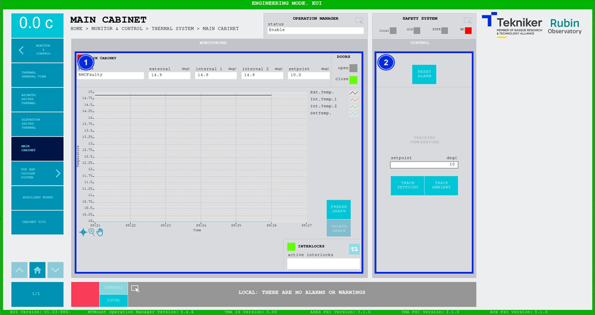

#### Main Cabinet Screen

This screen displays the temperature of the main cabinet of the MCS, TMA-AZ-CS-CBT-0001, and allows its control.

*Figure 2‑62. Main cabinet screen.*

<table class="table">
<colgroup>
<col style="width: 13<col style="width: 86</colgroup>
<thead>
<tr class="header">
<th>
ITEM
</th>
<th>
DESCRIPTION
</th>
</tr>
</thead>
<tbody>
<tr class="odd">
<td>
1
</td>
<td>
Displays the status, external temperature (in ºC), internal temperature 1 (in ºC), internal temperature 2
(in ºC) and the setpoint (in ºC) of the main cabinet.

This screen can have two different fault statuses:

<ul>
<li>
“RMCFAULTY”: This means that the temperature controller is not communicating correctly, but the system can
continue to operate.
</li>
<li>
“SPECIAL FAULT”: The cabinet temperature is out of range and the entire MCS will be shut down.

Displays whether the doors are open or closed. Lit up in green “open” if they are open,
or “close” if they are closed. If the doors are open, the system does not control the
temperature.
</li>
</ul>

Displays a graph with the temperatures in real time.

Softkey “FREEZE GRAPH”: Freezes the graph.

Softkey “UPDATE GRAPH”: 
Updates the graph, after it has been frozen.

The blue softkey navigates between the active interlocks, if there is more than one.

When an interlock is active, the top box is displayed in red. If no interlocks are active, the
box will be green and the blue softkey cannot be pressed.
</td>
</tr>
<tr class="even">
<td>
2
</td>
<td>
Softkey “RESET ALARM”: Resets the controller alarms or resets the interlock if
there is one.

Softkey “TRACK SETPOINT”: Enables manual temperature control using the value entered in
the control “setpoint”.

Softkey “TRACK AMBIENT”: Allows the temperature controller to track the ambient temperature.
</td>
</tr>
</tbody>
</table>
