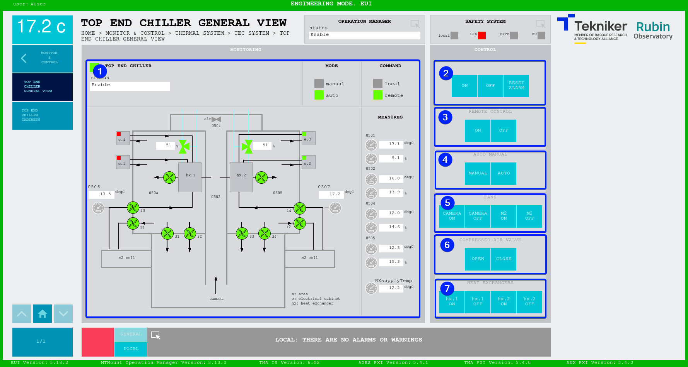
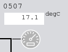

#### Top End Chiller General View Screen

This screen displays the status and allows the control of the Top End Chiller system.

*Figure 2‑63. Top End Chiller screen.*

<table class="table">
  <colgroup>
    <col style="width: 13<col style="width: 86
  </colgroup>
<thead>
<tr class="header">
      <th>
ITEM
</th>
      <th>
DESCRIPTION
</th>
    </tr>
  </thead>
  <tbody>
    <tr class="odd">
      <td>
1
</td>
      <td>
        

          Displays the status of the “Top End Chiller (TEC)” and lights up the
          upper box in the corresponding color.
        

        

          It shows, in green, whether the “Top End Chiller (TEC)” is in manual
          or automatic mode.
        

        

          If shows, in green, whether control is local or remote. This change
          requires the local system to get the command, that's why during this
          transition both remote and local LEDs are off, this is because the
          system is waiting for the local to take the control. It will light
          green once the local gets it.
        

        

          Displays the values of the general “Top End Chiller (TEC)” elements
          and lights up the elements in the corresponding color as they are
          activated:
        

        <ul>
          <li>
            
Grey: If the element is not active.

          </li>
          <li>
            
Green: If the element is active.

          </li>
          <li>
            
Red: If the element is faulty.

          </li>
        </ul>
      </td>
    </tr>
    <tr class="even">
      <td>
2
</td>
      <td>
        

          The following softkeys can only be used when the system is in
          automatic and remote mode.
        

        

          Softkey “ON”: Only switches on the “Top End Chiller (TEC)” if it is
          in “Idle”, in “REMOTE+AUTO” and if there is no active interlock.
        

        

          Softkey “OFF”: Switches off the “Top End Chiller (TEC)”, while in
          “REMOTE+AUTO”.
        

        

          Softkey “RESET ALARM”: Resets the system from its current alarm state
          or resets the interlock if one exists.
        

      </td>
    </tr>
    <tr class="odd">
      <td>
3
</td>
      <td>
        

          Softkey “ON”: Sets the “Top End Chiller (TEC)” to work in remote mode.
        

        

          Softkey “OFF”: Sets the “Top End Chiller (TEC)” to work in local mode. This will wait for the local to take
          the control.
        

      </td>
    </tr>
    <tr class="even">
      <td>
4
</td>
      <td>
        

          Softkey “MANUAL”: Sets the “Top End Chiller (TEC)” to work in manual mode.
        

        

          Softkey “AUTO”: Sets the “Top End Chiller (TEC)” to work in auto mode.
        

      </td>
    </tr>
    <tr class="odd">
      <td>
5
</td>
      <td>
        

          The following softkeys can only be used when the system is in manual
          and remote mode.
        

        
Softkey “CAMERA ON”: Turns on the fans for the camera.

        
Softkey “CAMERA OFF”: Turns off the fans for the camera.

        
Softkey M2 ON”: Turns on the fans for the M2.

        
Softkey M2 OFF”: Turns off the fans for the M2.

      </td>
    </tr>
    <tr class="even">
      <td>
6
</td>
      <td>
        

          The following softkeys can only be used when the system is in manual
          and remote mode.
        

        
Softkey “OPEN”: Opens the compressed air valve 0501

        
Softkey “CLOSE”: Closes the compressed air valve 0501

      </td>
    </tr>
    <tr class="odd">
      <td>
7
</td>
      <td>
        

          The following softkeys can only be used when the system is in manual
          and remote mode.
        

        
Softkey “hx1. ON”: Turns on the heat exchanger 1.

        
Softkey “hx1. OFF”: Turns off the heat exchanger 1.

        
Softkey “hx2. ON”: Turns on the heat exchanger 1.

        
Softkey “hx2. OFF”: Turns off the heat exchanger 1.

      </td>
    </tr>
  </tbody>
</table>

##### Icons

The table below shows the main icons present in the TEC.

| icon| name|
|----------|----------|
| | Fan |
|  | Valve|
| | Temperature sensor |
| | Humidity sensor |
