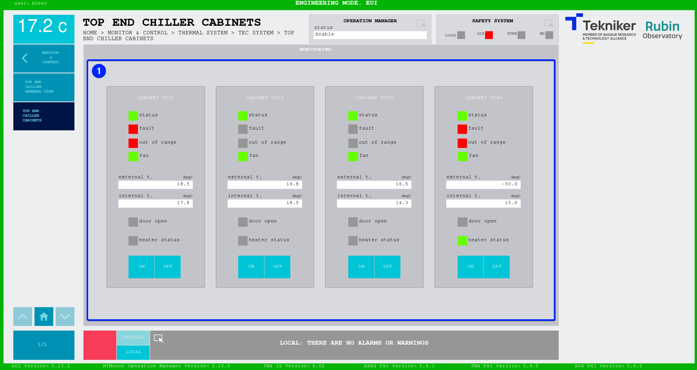

#### Top End Chiller Cabinets Screen

This screen displays the status and allows the control of the Top End Chiller cabinets.

<table>
  <colgroup>
    <col style="width: 13<col style="width: 86
  </colgroup>
<thead>
<tr class="header">
      <th>ITEM</th>
      <th>DESCRIPTION</th>
    </tr>
  </thead>
  <tbody>
    <tr class="odd">
      <td>1</td>
      <td>
        

          Displays the status of the “Top End Chiller (TEC)” Cabinets and lights up the LEDs in the corresponding color.
          All the cabinets display the same information described below:
        

        <ul>
          <li>
<i>status</i>: displays the status flag for the cabinet.
</li>
          <ul><li>
Grey: cabinet off.
</li></ul>
          <ul><li>
Green: cabinet on.
</li></ul>
          <li>
<i>fault</i>: displays the fault flag for the cabinet.
</li>
          <ul><li>
Grey: no fault detected.
</li></ul>
          <ul><li>
Red: fault detected.
</li></ul>
          <li>
<i>out of range</i>: displays the out of range flag for the cabinet.
</li>
          <ul><li>
Grey: in range
</li></ul>
          <ul><li>
Red: out of range.
</li></ul>
          <li>
<i>fan</i>: displays the status flag for the fan.
</li>
          <ul><li>
Grey: fan off.
</li></ul>
          <ul><li>
Green: fan on.
</li></ul>
          <li>
<i>external t.</i>: displays the cabinet external temperature.
</li>
          <li>
<i>internal t.</i>: displays the cabinet internal temperature.
</li>
          <li>
<i>door open</i>: displays the status flag for the door.
</li>
          <ul><li>
Grey: cabinet door closed.
</li></ul>
          <ul><li>
Green: cabinet door open.
</li></ul>
          <li>
<i>heater status</i>: displays the status flag for the heater.
</li>
          <ul><li>
Grey: heater off.
</li></ul>
          <ul><li>
Green: heater on.
</li></ul>
          <ul>

</ul>
          
The following softkeys can only be used when the system is in manual and remote mode.

          <ul><li>
"On": power on the cabinet.
</li></ul>
          <ul><li>
"OFF": power off the cabinet.
</li></ul>
        </ul>
      </td>
    </tr>
  </tbody>
</table>
