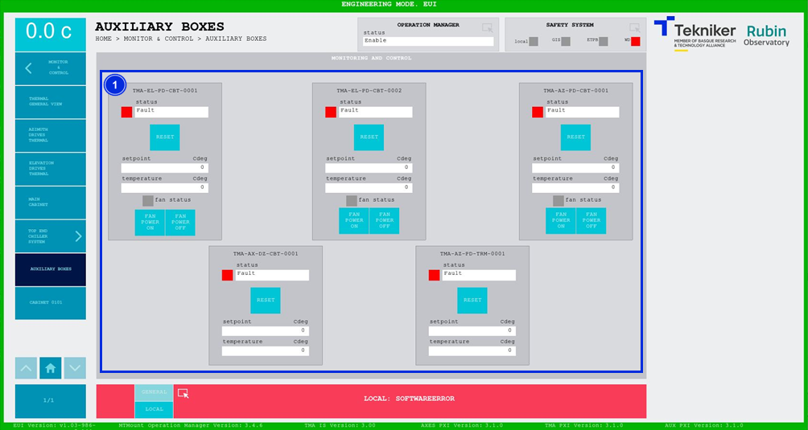

#### Auxiliary Boxes Screen

This screen displays and allows the adjustment of the temperature controllers of the different cabinets distributed around the telescope.

*Figure 2‑63. Auxiliary boxes screen.*

<table class="table">
<colgroup>
<col style="width: 13<col style="width: 86</colgroup>
<thead>
<tr class="header">
<th>
ITEM
</th>
<th>
DESCRIPTION
</th>
</tr>
</thead>
<tbody>
<tr class="odd">
<td>
1
</td>
<td>
“Status” bars show the status of the corresponding controller.

Softkeys “RESET”: Reset the corresponding controller.

Displays the setpoint (in ºC) and the temperature (in ºC) of the corresponding controller.

Displays the fan status. It remains grey when switched off, and lights up in green when it is
switched on.

Softkeys “FAN POWER ON”: Turn on the corresponding fan.

Softkeys “FAN POWER OFF”: Turn off the corresponding fan.
</td>
</tr>
</tbody>
</table>
