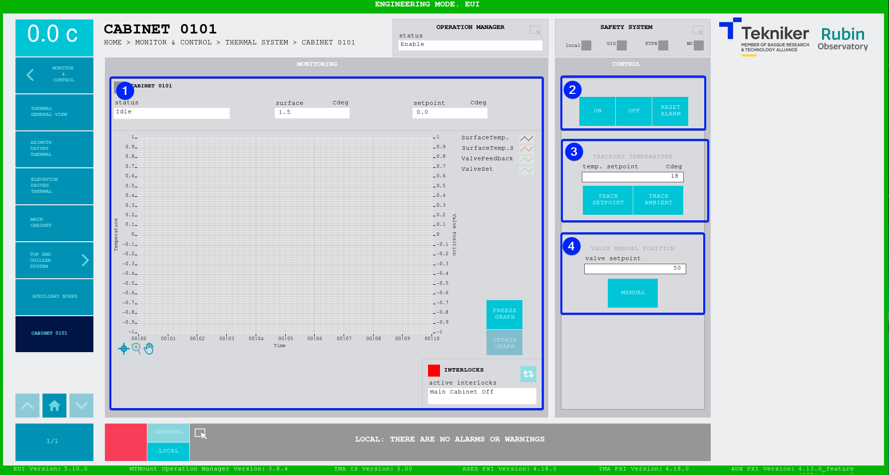

#### Cabinet 0101 Screen

This screen displays and controls the temperature of cabinet TMA-AZ-CS-CBT-0101.

*Figure 2‑64. Cabinet 0101 screen.*

<table class="table">
<thead>
<tr class="header">
<th>
ITEM
</th>
<th>
DESCRIPTION
</th>
</tr>
</thead>
<tbody>
<tr class="odd">
<td>
1
</td>
<td>
Displays the status, surface temperature (in ºC) and the setpoint (in ºC) of cabinet 0101.

Displays the graph with the temperatures in real time.

Softkey “FREEZE GRAPH”: Freezes the graph.

Softkey “UPDATE GRAPH”: 
Updates the graph, after it has been frozen.

The blue softkey navigates between the active interlocks, if there is more than one.

When an interlock is active, the top box is displayed in red. If no interlocks are active, the
box will be green and the blue softkey cannot be pressed.
</td>
</tr>
<tr class="even">
<td>
2
</td>
<td>
Softkey “ON”: Only turns on the system if no interlocks are active.

Softkey “OFF”: Turns off the system.

Softkey “RESET ALARM”: Resets the system from its current alarm state or resets the
interlock if one exists.
</td>
</tr>
<tr class="odd">
<td>
3
</td>
<td>
Softkey “TRACK SETPOINT”: Enables manual temperature control using the value entered in
control “temp. setpoint”.

Softkey “TRACK AMBIENT”: Allows the temperature controller to track the ambient temperature.
</td>
</tr>
<tr class="even">
<td>
4
</td>
<td>
Softkey “MANUAL”: Manually manages the opening of the value using the value entered in the
“valve setpoint” control.
</td>
</tr>
</tbody>
</table>
