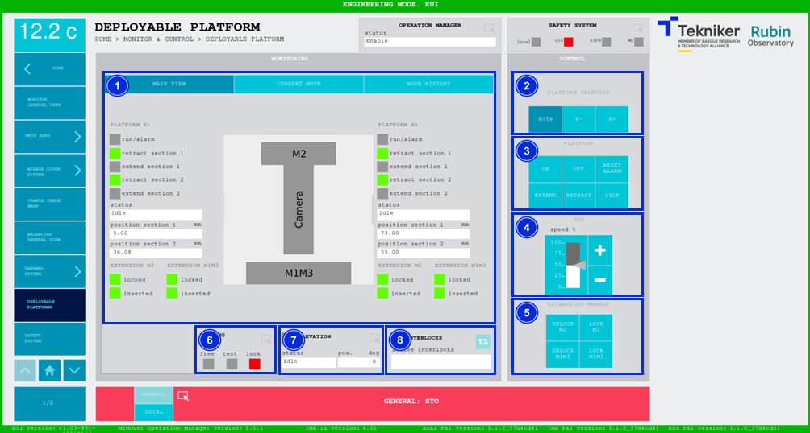
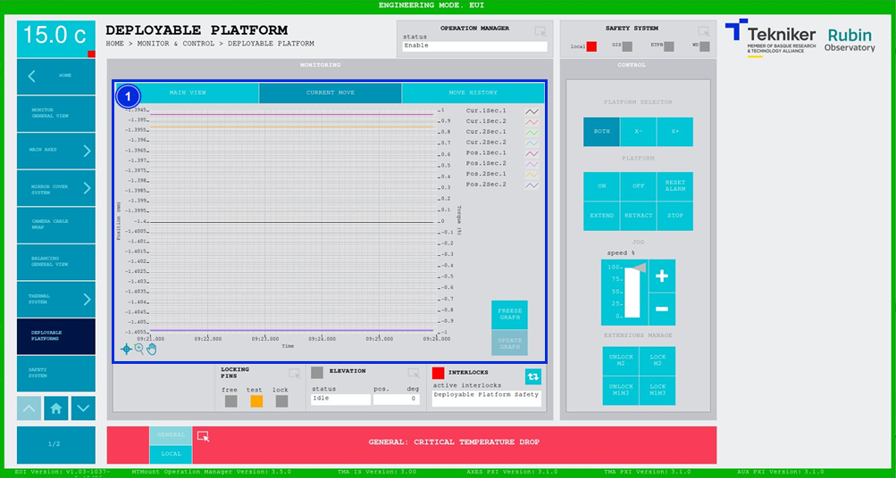
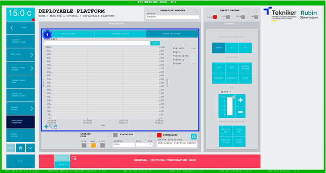

#### Deployable Platforms Screen

##### Deployable Platforms Screen -- Main View

This screen displays the deployable platforms and enables their control.

*Figure 2‑65. Deployable platforms screen - main view.*

<table class="table">
<thead>
<tr class="header">
<th>
ITEM
</th>
<th>
DESCRIPTION
</th>
</tr>
</thead>
<tbody>
<tr class="odd">
<td>
1
</td>
<td>
Displays the status, the section 1 position (in mm) and the section 2 position (in mm) of each
platform.

The box next to “run/alarm” lights up in the colour corresponding to the status of each platform.

The green “retract” LEDs light up when the sections of the corresponding
platforms are retracted.

The green “extend” LEDs light up when the sections of the corresponding
platforms are extended.

The green “locked” LEDs light up when the corresponding extensions are
locked.

The green “inserted” LEDs light up when the corresponding extensions are
inserted.
</td>
</tr>
<tr class="even">
<td>
2
</td>
<td>
Softkey “BOTH”: Selects both platforms.

Softkeys “X-” and “X+”: Selects the corresponding platform.
</td>
</tr>
<tr class="odd">
<td>
3
</td>
<td>
Softkey “ON”: Only turns on the system if no interlocks are active.

Softkey “OFF”: Turns off the system.

Softkey “RESET ALARM”: Resets the system from its current alarm state or resets the
interlock if one exists.

Softkey “EXTEND”: Extends the previously selected platform.

Softkey “RETRACT”: Retracts the previously selected platform.

Softkey “STOP”: Stops the movement.
</td>
</tr>
<tr class="even">
<td>
4
</td>
<td>
Softkeys “+” or “-”: Makes a movement at a constant speed in a positive or negative direction
respectively. This sets the percentage of the default speed defined in the settings with the
vertical slider.
</td>
</tr>
<tr class="odd">
<td>
5
</td>
<td>
Softkeys “UNLOCK M2” and “UNLOCK M1M3”: Unlocks the extensions of the corresponding platforms.
M1M side extensions can only be extended if the “Mirror Cover” is retracted.

Softkeys “LOCK M2” and “LOCK M1M3”: Lock the extensions of the corresponding platforms.

<table class="table">
<tbody>
<tr class="odd">
<td>ℹ️</td>
<td>
These must be inserted to lock the platform extensions. Inserting the extensions
(as well as extracting them) is an action that has to be carried out manually from the platform itself.
</td>
</tr>
</tbody>
</table></td>
</tr>
<tr class="even">
<td>
6
</td>
<td>
Accesses the screen [“Locking Pins General View”](./004_LockingPins.md)

Displays the status of the locking pins and turns on the LED with the corresponding colour:

<ul>
<li>
“FREE”: Means that the locking pins are free and lights up in green.
</li>
<li>
“TEST”: Means that the pins are being tested, and lights up orange.
</li>
<li>
“LOCK”: Means that the pins are locked, and lights up red.
</li>
</ul></td>
</tr>
<tr class="odd">
<td>
7
</td>
<td>
Displays the status and position (in deg) of “Elevation”.

Accesses the screen [“Elevation General View”](./002_ElevationGeneralView.md)
</td>
</tr>
<tr class="even">
<td>
8
</td>
<td>
The blue softkey navigates between the active interlocks, if there is more than one.

When an interlock is active, the top box is displayed in red. If no interlocks are active, the
box will be green and the blue softkey cannot be pressed.
</td>
</tr>
</tbody>
</table>

##### Deployable Platforms Screen -- Current Move

This screen shows a graph of the movement of the deployable platforms in real time.

*Figure 2‑66. Deployable platforms screen - current view.*

<table class="table">
<thead>
<tr class="header">
<th>
ITEM
</th>
<th>
DESCRIPTION
</th>
</tr>
</thead>
<tbody>
<tr class="odd">
<td>
1
</td>
<td>
Displays a graph of the movement of the deployable platforms in real time.

Softkey “FREEZE GRAPH”: Freezes the graph.

Softkey “UPDATE GRAPH”: Allows the graph to be updated after being frozen.
</td>
</tr>
</tbody>
</table>

##### Deployable Platforms Screen -- Move History

This screen displays and loads the last five movements of the deployable platforms, with number 1 being the last.

*Figure 2‑67. Deployable platforms screen - move history.*

<table class="table">
<thead>
<tr class="header">
<th>
ITEM
</th>
<th>
DESCRIPTION
</th>
</tr>
</thead>
<tbody>
<tr class="odd">
<td>
1
</td>
<td>
Softkey “LOAD”: Loads the last five movements.

Once the desired movement has been selected, it allows it to be displayed on the graph.
</td>
</tr>
</tbody>
</table>
