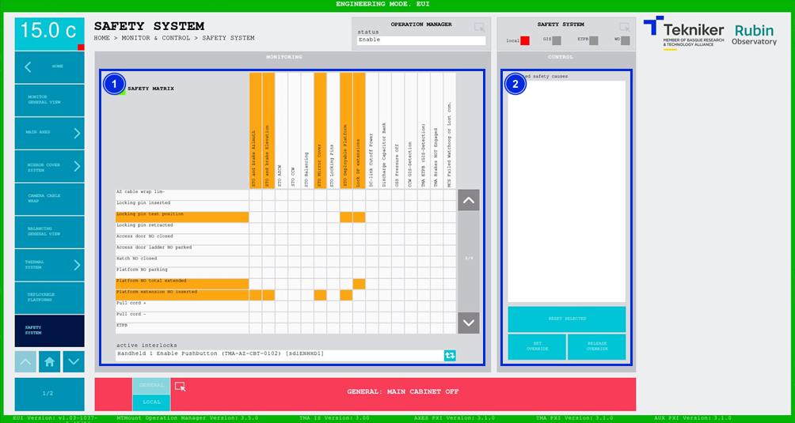

#### Safety System Screen

This screen shows the safety system in table format. The rows being the causes, and the columns the sub-systems/effects. When a row is activated, the boxes corresponding to the subsystems/effects affected by that cause are coloured in. There are four different colors:

- White: No active interlock.

- Orange: An interlock is active. No operation by the operator is required. Once the cause is solved, it is released without resetting.

- Red: An interlock is active. The cause of the interlock needs to be reset by the operator once it has been resolved.

- Purple: overrides the cause for a certain amount of time (180s). The interlock reappears if the cause is not released and reset during this time.

*Figure 2‑68. Safety system screen.*

<table>
<colgroup>
<col style="width: 13<col style="width: 86</colgroup>
<thead>
<tr class="header">
<th>ITEM</th>
<th>DESCRIPTION</th>
</tr>
</thead>
<tbody>
<tr class="odd">
<td>1</td>
<td>
Displays the table of causes and subsystems.

Enables browsing through the interlocks.

Enables selection of the desired causes to be added to the item 2 list.
</td>
</tr>
<tr class="even">
<td>2</td>
<td>
Displays the selected causes.

Softkey “RESET SELECTED”: Resets the selected cause (or causes). If the cause is not active it will
reset. If it remains active it will not reset.

Softkey "SET OVERRIDE": override allows the established limit to be exceeded, for those settings where this is
permitted. This action lasts for a certain time (180s). If the cause is not released and reset during this time,
the interlock reappears.

Softkey “RELEASE OVERRIDE”: Releases the setting and it is no longer possible to exceed its limit.
</td>
</tr>
</tbody>
</table>
