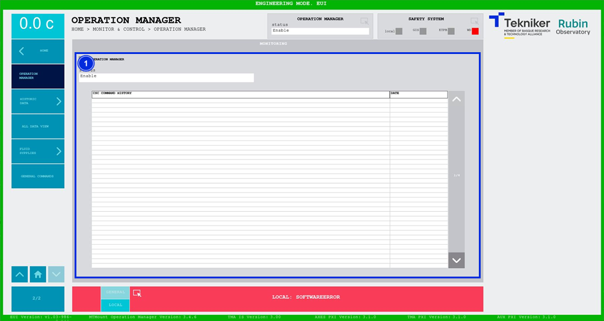

#### Operation Manager Screen

This screen shows a history of all commands sent by the CSC. It is a monitoring screen only.

*Figure 2‑69. Operation manager screen.*

<table class="table">
<thead>
<tr class="header">
<th>
ITEM
</th>
<th>
DESCRIPTION
</th>
</tr>
</thead>
<tbody>
<tr class="odd">
<td>
1
</td>
<td>
Displays the status of the C++ application that receives the commands and sends them to the PXI, named "MtMount Operation
Manager”. The top box lights up in the corresponding colour.

A list is displayed with the history of commands received from the CSC along with their respective dates.

Arrow softkeys allow you to scroll up and down the list, if the list is on more than one page.
</td>
</tr>
</tbody>
</table>
