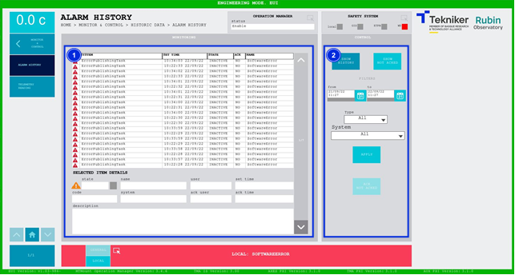

#### Alarm History Screen

This screen displays the system alarm history and enables its control.

*Figure 2‑70. Alarm history screen.*

<table>
<colgroup>
<col style="width: 13<col style="width: 86</colgroup>
<thead>
<tr class="header">
<th>ITEM</th>
<th>DESCRIPTION</th>
</tr>
</thead>
<tbody>
<tr class="odd">
<td>1</td>
<td>
An alarm history list is displayed.

Clicking on one of the alarms displays its details at the bottom.
</td>
</tr>
<tr class="even">
<td>2</td>
<td>
Softkey “SHOW HISTORY”: Displays the history in the list, read from a file.

Softkey “SHOW NOT ACKED”: Displays the alarms marked as not seen. These are the ones with a “NO”.
written in the “ACK” column.

Applies a series of filters to facilitate the search, such as start and end dates, type
of alarm or system.

Softkey “APPLY”: Applies filters to the search.

Softkey “ACK NOT ACKED”: Marks alarms that have not been seen as seen, only when the
“SHOW NOT ACKED” softkey is selected.
</td>
</tr>
</tbody>
</table>
