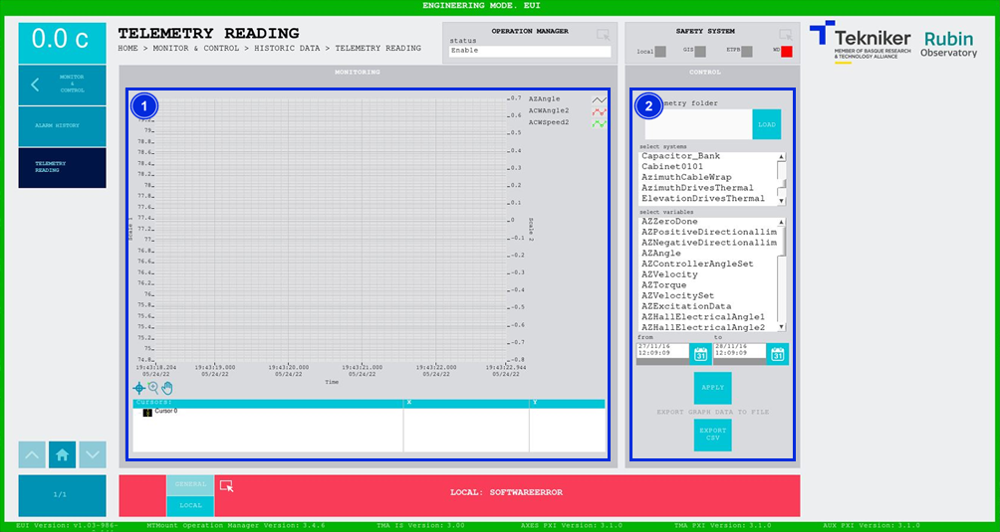

#### Telemetry Reading Screen

This screen allows an analysis to be performed of locally saved telemetry. The telemetry available for this window is 1
hour. However, there are 2 days worth of telemetry stored locally. To access data older than 1 hour, the telemetry files
must be unzipped and saved in a different location. Indicate this location when loading the data, for access to this
older data.

*Figure 2‑71. Telemetry reading screen*

<table>
<colgroup>
<col style="width: 13<col style="width: 86</colgroup>
<thead>
<tr class="header">
<th>ITEM</th>
<th>DESCRIPTION</th>
</tr>
</thead>
<tbody>
<tr class="odd">
<td>1</td>
<td>A graph is displayed showing the loaded telemetry data history.</td>
</tr>
<tr class="even">
<td>2</td>
<td>
Softkey “LOAD”: Selects the desired telemetry file.

The selection can be filtered by choosing the desired systems and variables. The available variables will change
depending on the selected systems. To select more than one option at the same time, press and
hold "ctrl". It is also possible to filter by time period by entering a start and end date.

Softkey “APPLY”: Applies filters to the search.

Softkey “EXPORT CSV”: Exports the information to a CSV type file.
</td>
</tr>
</tbody>
</table>
