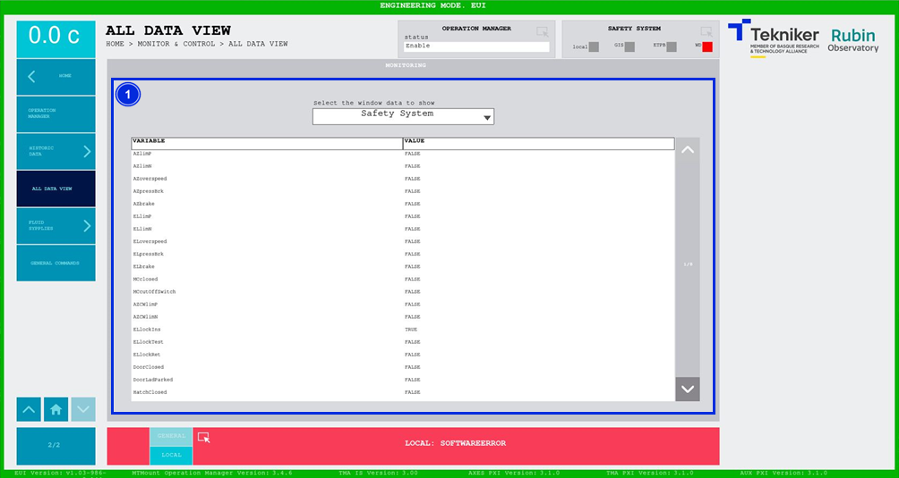

#### All Data View Screen

This screen shows a list of data from any subsystem (topic) in real time. It is a monitoring screen only.

*Figure 2‑72. All data view screen.*

<table class="table">
<colgroup>
<col style="width: 13<col style="width: 86</colgroup>
<thead>
<tr class="header">
<th>
ITEM
</th>
<th>
DESCRIPTION
</th>
</tr>
</thead>
<tbody>
<tr class="odd">
<td>
1
</td>
<td>
This screen displays the list of data from any subsystem in real time, together with their
respective values.

The sub-system can be selected in the drop-down window at the top.
</td>
</tr>
</tbody>
</table>
