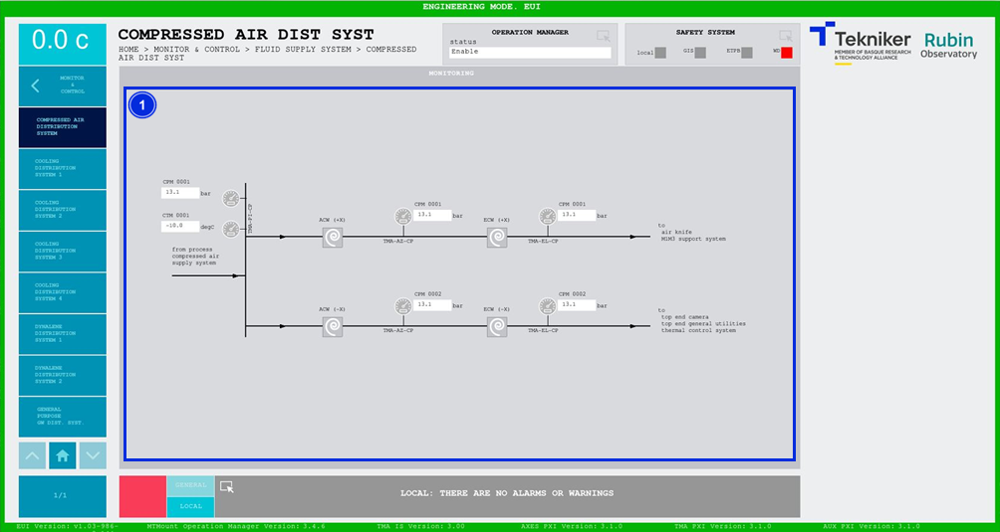

#### Compressed Air Distribution System Screen

This screen displays the pressures and temperatures of the compressed air distribution system. It is a monitoring screen only.

*Figure 2‑73. Compressed air distribution system screen.*

| ITEM| DESCRIPTION|
|----------|----------|
| 1| Displays the pressures (in bar) and temperature (in ºC) of the compressed air distribution system.|
