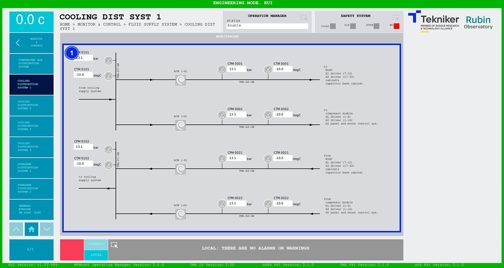

#### Cooling Distribution System 1 screen

This screen displays the pressures and temperatures of the cooling system. It is a monitoring screen only.

*Figure 2‑74. Cooling distribution system 1 screen.*

| ITEM| DESCRIPTION|
|----------|----------|
| 1| Displays pressures (in bar) and temperatures (in ºC) of the cooling system.|
