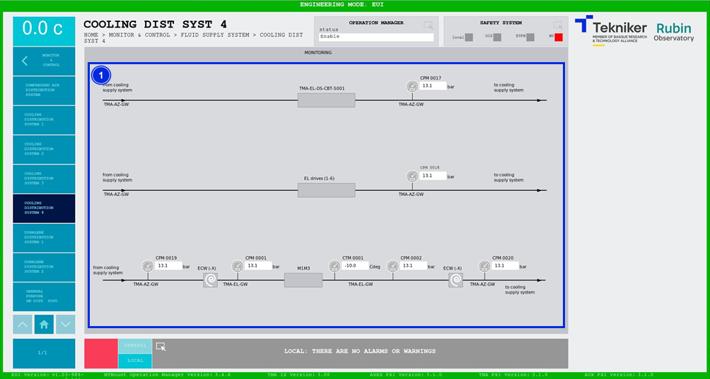

#### Cooling Distribution System 4 screen

This screen displays the pressures and temperatures of the cooling system. It is a monitoring screen only.

*Figure 2‑77. Cooling distribution system 4 screen.*

| ITEM| DESCRIPTION|
|----------|----------|
| 1| Displays the pressures (in bars) and temperature (in ºC) of the cooling system.|
