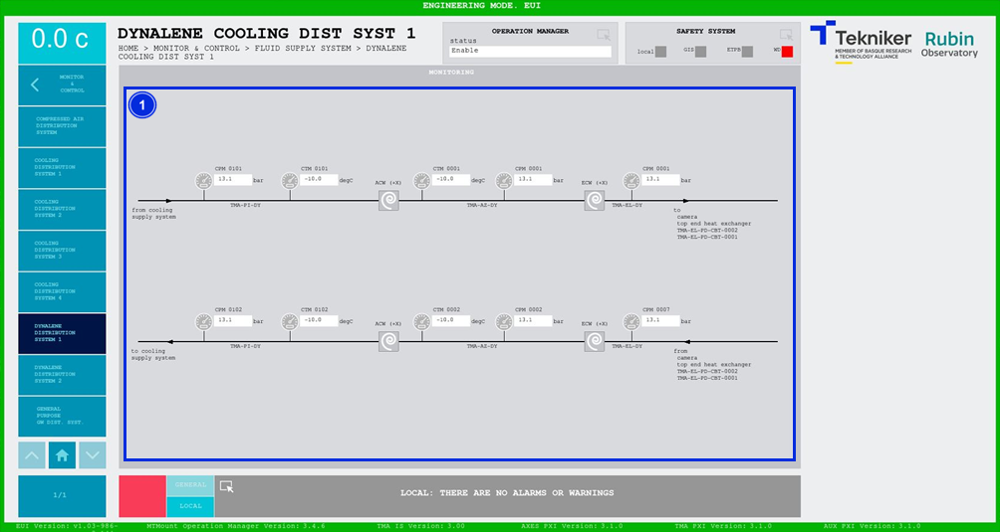

#### Dynalene Cooling Distribution System 1 screen

This screen displays the pressures and temperatures of the Dynalene cooling system. It is a monitoring screen only.

*Figure 2‑78. Dynalene cooling distribution system 1 screen.*

| ITEM| DESCRIPTION|
|----------|----------|
| 1| Displays the pressures (in bar) and temperatures (in ºC) of the Dynalene cooling system.|
