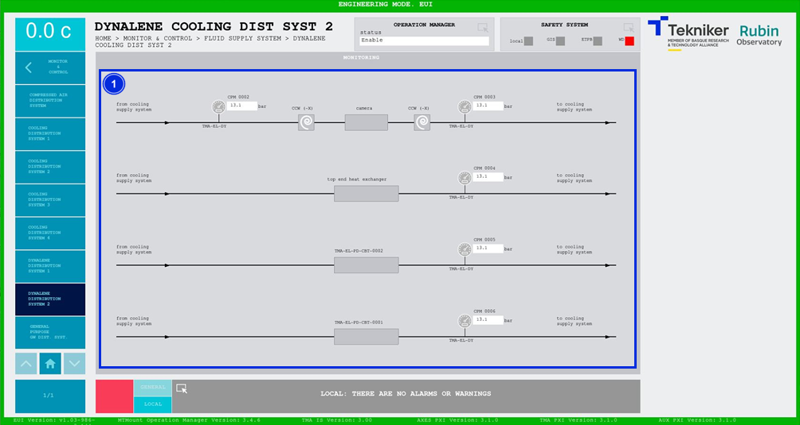

#### Dynalene Cooling Distribution System 2 screen

This screen displays the pressures and temperatures of the Dynalene cooling system. It is a monitoring screen only.

*Figure 2‑79. Dynalene cooling distribution system 2 screen.*

| ITEM| DESCRIPTION|
|----------|----------|
| 1| It displays the pressures (in bar) of the  Dynalene cooling system.|
