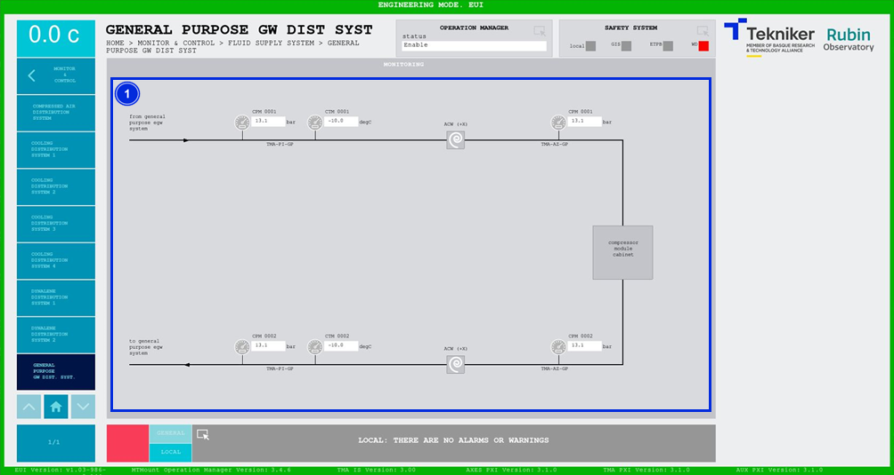

#### General Purpose GW Dist. Syst. Screen

This screen shows the pressures of the General Purpose Glycol Distribution System. It is a monitoring screen only.

*Figure 2‑80. General purpose gw dist. syst. screen*

| ITEM| DESCRIPTION|
|----------|----------|
| 1| Displays pressures (in bar) and temperatures (in ºC) of the general purpose glycol system.|
