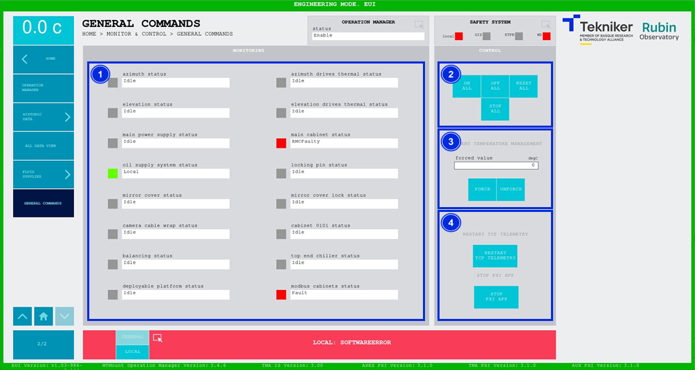

#### General Commands Screen

This screen displays all systems and allows general commands to be sent to all systems.

*Figure 2‑81. General commands screen.*

<table>
<colgroup>
<col style="width: 13<col style="width: 86</colgroup>
<thead>
<tr class="header">
<th>ITEM</th>
<th>DESCRIPTION</th>
</tr>
</thead>
<tbody>
<tr class="odd">
<td>1</td>
<td>
Displays the status of the most general subsystems. The following colours
show their statuses:

<ul>
<li>
Grey, the system is off.
</li>
<li>
Green, the system is on.
</li>
<li>
Red, the system has a fault.
</li>
</ul></td>
</tr>
<tr class="even">
<td>2</td>
<td>
Softkey “ON”: Turns everything on.

Softkey “OFF”: Turns everything off.

Softkey “RESET ALL”: Resets everything.

Softkey “STOP ALL”: Stops everything.
</td>
</tr>
<tr class="odd">
<td>3</td>
<td>
Softkey “FORCE”: Forces the ambient temperature. The value shown at the top left of the screen
is updated and a red box is displayed on the left of the screen to indicate that the value is forced.

Softkey “UNFORCE”: Stops forcing the ambient temperature.
</td>
</tr>
<tr class="even">
<td>4</td>
<td>
Softkey “RESTART TCP TELEMETRY”: Restarts the TCP telemetry server, which sends telemetry to
CSC.

Softkey “STOP PXI APP”: Deletes and controls the main PXI.
</td>
</tr>
</tbody>
</table>
