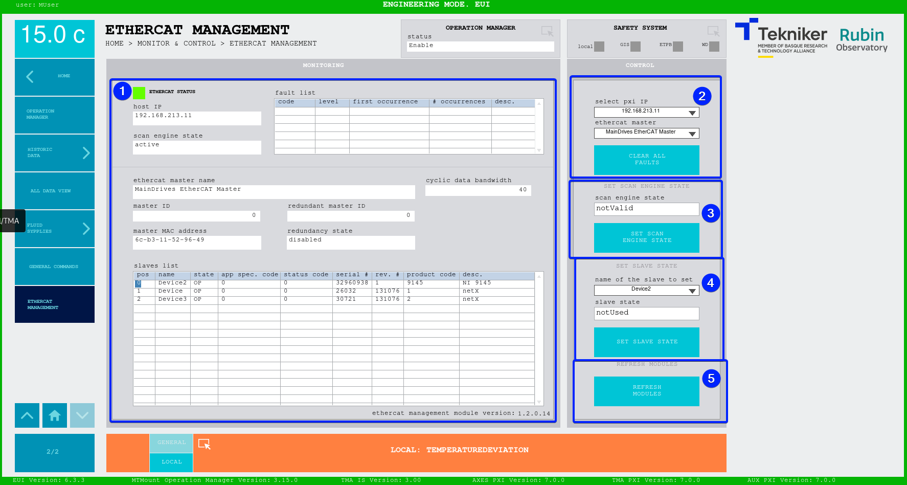

#### Ethercat Management Screen

> 🛑 **PERSONNEL USING THIS WINDOW MUST BE AWARE OF EACH AND EVERY RISK ASSOCIATED WITH EACH ACTION.**

This screen displays the status of the ethercat for the selected master and allows to perform several actions with it.

*Figure. Ethercat Management screen.*

> ⚠️ This window is updated only when called, that's why when loaded it automatically performs actions, wait for those
> to be complete before performing any actions on it. Additionally, to keep it up to date, the window is automatically
> refreshed after 30s without any actions on it

<table class="table">
  <thead>
    <tr class="header">
      <th>
ITEM
</th>
      <th>
DESCRIPTION
</th>
    </tr>
  </thead>
  <tbody>
    <tr class="odd">
      <td>
1
</td>
      <td>
        
Displays the status of the ethercat master specified on item 2

        <ul>
          <li>
Top part:
</li>
          <ul>
            <li>
ETHERCAT STATUS:
</li>
            <ul>
              <li>
Green, the system has no faults.
</li>
              <li>
Red, the system has a fault.
</li>
            </ul>
            <li>
host IP, the selected IP from item 2
</li>
            <li>
scan engine state, the current state of the scan engine for the host, this must be active for the TMA to be operational
</li>
            <li>
fault list, the list of faults from the host, this must be empty
</li>
          </ul>
          <li>
Bottom part:
</li>
          <ul>
            <li>
ethercat master name, the name of the selected master from item 2
</li>
            <li>
cyclic data bandwidth, the bandwidth of the cyclic data for the selected master
</li>
            <li>
master ID, the ethercat ID for the selected master
</li>
            <li>
redundant master ID, the ethercat ID for the redundancy master of the selected master
</li>
            <li>
master MAC address, the MAC address of the selected master
</li>
            <li>
redundancy state, the state of the ethercat line redundancy, if disabled there is no ethercat master
              redundancy
</li>
            <li>
slave list, here the list of slaves connected to the selected master are displayed
</li>
            <li>
ethercat management module version, the version of the ethercat management module running on the PXI
</li>
          </ul>
        </ul>
      </td>
    </tr>
    <tr class="even">
      <td>
2
</td>
      <td>
        
select pxi IP, for selecting the IP of the PXI to get the data from

        
ethercat master, for selecting the ethercat master of the specified PXI

        
Softkey “CLEAR ALL FAULTS”: clear all the faults from the selected PXI.

      </td>
    </tr>
    <tr class="odd">
      <td>
3
</td>
      <td>
        
scan engine state, for selecting the desired state of the scan engine for the PXI specified on item 2

        
Softkey “SET SCAN ENGINE STATE”: sets the scan engine to the selected state. This action requires confirmation by pop up

      </td>
    </tr>
    <tr class="even">
      <td>
4
</td>
      <td>
        
name of the slave to set, for selecting the desired slave to be managed

        
slave state, for selecting the desired state of the selected slave

        
Softkey “SET SLAVE STATE”: sets the slave state to the specified one. This action requires confirmation by pop up

      </td>
    </tr>
    <tr class="odd">
      <td>
5
</td>
      <td>
        
Softkey “REFRESH MODULES”: refresh the modules for the selected ethercat master, this is used for enabling the
          redundancy when connected as an ethercat ring. This action requires confirmation by pop up

      </td>
    </tr>
  </tbody>
</table>

> Items 3, 4 and 5 are only visible for maintenance level users

##### Slave states

| Slave State | Meaning                                                                                                                 |
| ----------- | ----------------------------------------------------------------------------------------------------------------------- |
| Unknown     | Communication to the slave is not possible                                                                              |
| Init        | The slave initialized, has communication with the master                                                                |
| PreOP       | Ready for entering operational state                                                                                    |
| BootStrap   | Boot strap state, this should not appear                                                                                |
| SafeOP      | Safe operational state, prior to operational                                                                            |
| OP          | Operational state, this is the state for the slaves to be sending/receiving data, this is the nominal state for the TMA |
