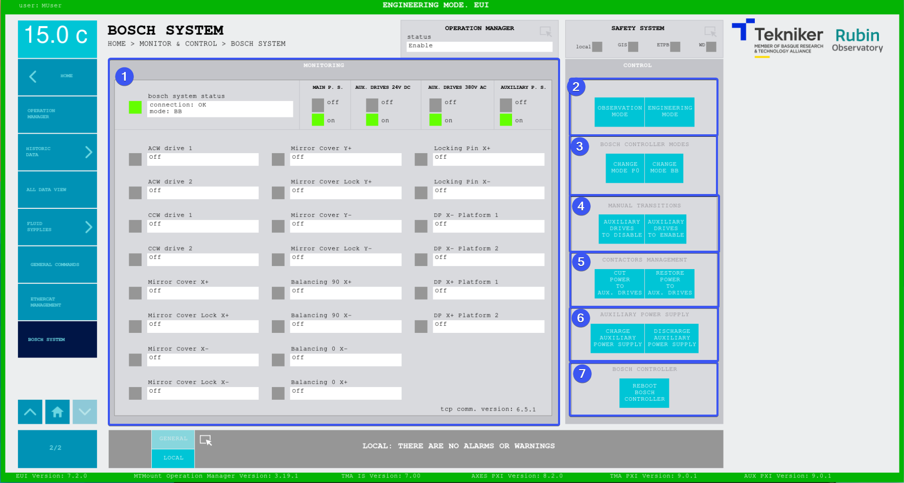

#### Bosch System Screen

This screen displays the status of the bosch system as well as the related drives and allows to perform several actions with it.

The main ones are:

- Switching to observation mode, where the power for both cable wraps is kept ON and the power for all the auxiliary
  drives (Mirror Covers, Balancing, Locking pins and Deployable platforms) is OFF.
- Switching to engineering mode, where everything is ON.

*Figure. Bosch System screen.*

<table class="table">
  <thead>
    <tr class="header">
      <th>
ITEM
</th>
      <th>
DESCRIPTION
</th>
    </tr>
  </thead>
  <tbody>
    <tr class="odd">
      <td>
1
</td>
      <td>
        
Displays the status of the bosh system and the bosch drives

        <ul>
          <li>
Top part:
</li>
          <ul>
            <li>
bosch system status:
</li>
            <ul>
              <li>
Green, the system has no faults.
</li>
              <li>
Red, the system has a fault.
</li>
            </ul>
            <li>
MAIN P. S.: this is the status of the main bosch power supply, the one for the cable wraps
</li>
            <li>
AUX. DRIVES 24V DC: this is the status of the contactor for the 24V DC power for the control part of the auxiliary drives
</li>
            <li>
AUX. DRIVES 380V AC: this is the status of the contactor for the 380V AC power for the power supply of the auxiliary drives
</li>
            <li>
AUXILIARY P. S.: this is the status of the auxiliary bosch power supply, the one for the auxiliary drives
</li>
          </ul>
          <li>
Bottom part: displays the status of each of the drives from the bosch system
</li>
          <li>
tcp comm. version: displays the version of the tcp communication protocol between the bosch controller and the TMA PXI
</li>
        </ul>
      </td>
    </tr>
    <tr class="even">
      <td>
2
</td>
      <td>
        
Softkey “OBSERVATION MODE”: sets the system in the proper state for observation, ONLY cable wrap drives are powered.
        <a href="https://ts-tma.lsst.io/docs/tma_pxi-controller_documentation/03%20Bosch%20System%20Management/01%20Bosch%20Task.html#changetoobservationmode">more doc on the command here</a>

        
Softkey “ENGINEERING MODE”: sets the system in the proper state for engineering, all bosch drives are powered.
        <a href="https://ts-tma.lsst.io/docs/tma_pxi-controller_documentation/03%20Bosch%20System%20Management/01%20Bosch%20Task.html#changetoengineeringmode">more doc on the command here</a>

      </td>
    </tr>
    <tr class="odd">
      <td>
3
</td>
      <td>
        
Softkey “CHANGE MODE P0”: sets the bosch controller state to P0
        <a href="https://ts-tma.lsst.io/docs/tma_pxi-controller_documentation/03%20Bosch%20System%20Management/01%20Bosch%20Task.html#changetop0">more doc on the command here</a>

        
Softkey “CHANGE MODE BB”: sets the bosch controller state to BB
        <a href="https://ts-tma.lsst.io/docs/tma_pxi-controller_documentation/03%20Bosch%20System%20Management/01%20Bosch%20Task.html#changetobb">more doc on the command here</a>

      </td>
    </tr>
    <tr class="even">
      <td>
4
</td>
      <td>
        
Softkey “AUXILIARY DRIVES TO DISABLE”: change the drives listed in the `AuxiliaryDrivesMotorIDs` setting to *disabled* state
        <a href="https://ts-tma.lsst.io/docs/tma_pxi-controller_documentation/03%20Bosch%20System%20Management/01%20Bosch%20Task.html#changeauxdrivestodisable">more doc on the command here</a>

        
Softkey “AUXILIARY DRIVES TO ENABLE”: change the drives listed in the `AuxiliaryDrivesMotorIDs` setting to *enabled* state
        <a href="https://ts-tma.lsst.io/docs/tma_pxi-controller_documentation/03%20Bosch%20System%20Management/01%20Bosch%20Task.html#changeauxdrivestoenable">more doc on the command here</a>

      </td>
    </tr>
    <tr class="odd">
      <td>
5
</td>
      <td>
        
Softkey “CUT POWER TO AUX. DRIVES”: set the value of the digital signals controlling the 24V and 380V contactors to *FALSE*
        <a href="https://ts-tma.lsst.io/docs/tma_pxi-controller_documentation/03%20Bosch%20System%20Management/01%20Bosch%20Task.html#cutpowertoauxdrives">more doc on the command here</a>

        
Softkey “RESTORE POWER TO AUX. DRIVES”: set the value of the digital signals controlling the 24V and 380V contactors to *TRUE*
        <a href="https://ts-tma.lsst.io/docs/tma_pxi-controller_documentation/03%20Bosch%20System%20Management/01%20Bosch%20Task.html#restorepowertoauxdrives">more doc on the command here</a>

      </td>
    </tr>
  </tbody>
    <tr class="even">
      <td>
6
</td>
      <td>
        
Softkey “CHARGE AUXILIARY POWER SUPPLY”: charge the auxiliary drives power supply
        <a href="https://ts-tma.lsst.io/docs/tma_pxi-controller_documentation/03%20Bosch%20System%20Management/01%20Bosch%20Task.html#auxiliarypscharge">more doc on the command here</a>

        
Softkey “DISCHARGE AUXILIARY POWER SUPPLY”: discharge the auxiliary drives power supply
        <a href="https://ts-tma.lsst.io/docs/tma_pxi-controller_documentation/03%20Bosch%20System%20Management/01%20Bosch%20Task.html#auxiliarypsdischarge">more doc on the command here</a>

      </td>
    </tr>
    <tr class="odd">
      <td>
7
</td>
      <td>
        
Softkey “REBOOT BOSCH CONTROLLER”: send reboot request to the bosch controller and wait for it to be rebooted,
        a pop up will appear to config the operation.
        <a href="https://ts-tma.lsst.io/docs/tma_pxi-controller_documentation/03%20Bosch%20System%20Management/01%20Bosch%20Task.html#boschcontrollerreboot">more doc on the command here</a>

      </td>
    </tr>
  </tbody>
</table>

> Items 3, 4, 5, 6 and 7 are only visible for maintenance level users

##### Drives states

These states are displayed in the bottom part of section 1.

| Drive State                 | Meaning                                                   |
| --------------------------- | --------------------------------------------------------- |
| NOT Control and Power Ready | Drive not ready to be used by the corresponding subsystem |
| Discrete Motion             | Drive moving discretely                                   |
| Standstill                  | Drive on and waiting                                      |
| Off                         | Drive off                                                 |
