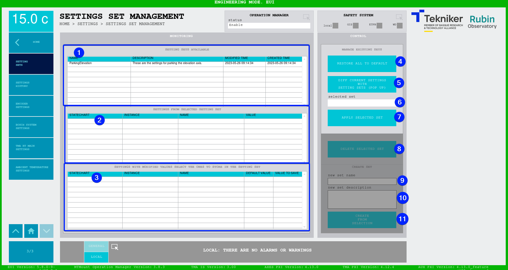
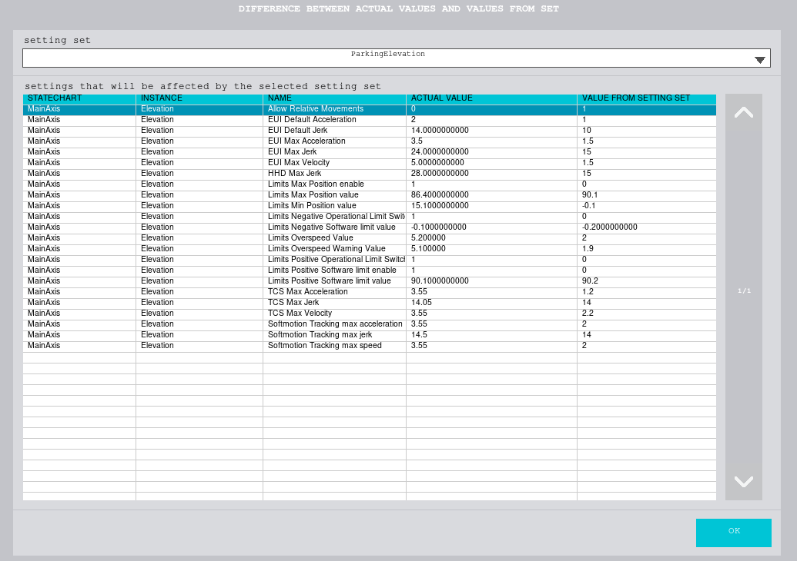

#### Settings Set Management Screen

This screen displays different settings sets that can be managed. The applied settings affect all elements of the MCS.

*Figure 2‑97. Settings set management screen.*

| ITEM| DESCRIPTION|
|----------|----------|
| 1| Displays the list of available setting sets|
| 2| Displays the settings contained in the selected setting set|
| 3| Displays the list of settings that have a value in use different to the default value. These settings are the ones that can be selected and saved in a new setting set when creating it. If none is selected, the setting set will not be created|
| 4| "RESTORE ALL TO DEFAULT": restores all settings to their default values|
| 5| "DIFF CURRENT SETTINGS WITH SETTING SETS (POP UP)": opens a pop-up window, [see](#diff-current-settings-with-setting-sets-pop-up)|
| 6| "selected set": displays the name of the selected setting set|
| 7| "APPLY SELECTED SET": applies the selected setting set by changing the values in use|
| 8| "DELETE SELECTED SET": deletes the selected setting set, this action is not reversible and a pop-up window requests a YES or NO answer|
| 9| "new set name": name to create a new setting set (mandatory to create a set)|
| 10| "new set description": set description (optional for creating a set)|
| 11| "CREATE FROM SELECTION": creates a new setting set with the specified name and description, in which the values selected in *item 3* are included|

##### DIFF CURRENT SETTINGS WITH SETTING SETS (POP UP)

This screen is displayed by pressing "DIFF CURRENT SETTINGS WITH SETTING SETS (POP UP)" in the "Settings Set Management" window. This screen displays the values that will be modified when applying the selected setting set using the "setting set" drop-down menu.

*Figure 2‑97.2. Diff current settings with settings sets screen (this is a pop-up window).*
