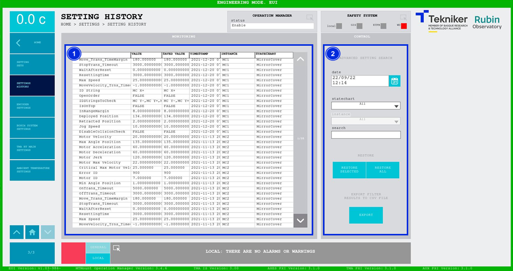

#### Setting History Screen

This screen shows the setting history. It also allows the desired settings to be applied.

*Figure 2‑98. Setting history screen.*

<table class="table">
<thead>
<tr class="header">
<th>
ITEM
</th>
<th>
DESCRIPTION
</th>
</tr>
</thead>
<tbody>
<tr class="odd">
<td>
1
</td>
<td>
Displays the settings that were present at a given time.
</td>
</tr>
<tr class="even">
<td>
2
</td>
<td>
Allows you to work with the settings history.

Filters the settings search to make work easier. It is possible to filter by date, subsystem,
instance or text.

Softkey “RESTORE SELECTED”: Restores the selected setting.

Softkey “RESTORE ALL”: Restores all settings.

Softkey “EXPORT”: Exports the setting information.
</td>
</tr>
</tbody>
</table>
