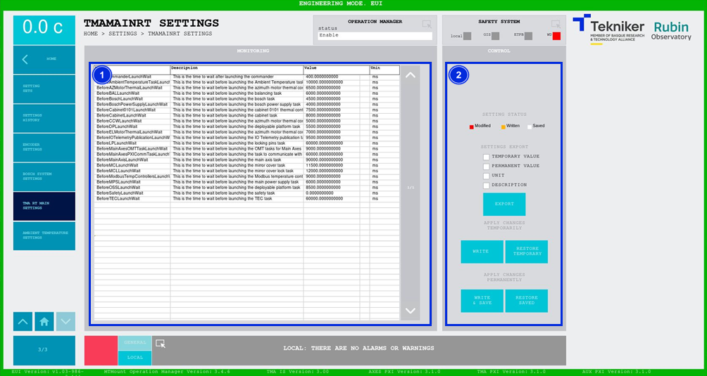

#### TMA RT MAIN Settings screen

This screen displays the list of "TMA RT MAIN” settings and enables their control.

*Figure 2‑101. TMA RT MAIN settings screen.*

<table>
<colgroup>
<col style="width: 13<col style="width: 86</colgroup>
<thead>
<tr class="header">
<th>ITEM</th>
<th>DESCRIPTION</th>
</tr>
</thead>
<tbody>
<tr class="odd">
<td>1</td>
<td>Displays the list of “TMA RT MAIN” settings.</td>
</tr>
<tr class="even">
<td>2</td>
<td>
Changes the value of the list settings.

Softkey “EXPORT”: Exports the data selected at the top.

Softkey “WRITE”: Applies the change made to a setting. The subsystem uses this value for the next
start-up.

Softkey “RESTORE TEMPORARY”: Recovers the written values, i.e. those saved as
“Write”.

Softkey “WRITE &amp; SAFE”: Changes the modified settings (used by the subsystem) and permanently saves them in
the database.

Softkey “RESTORE SAVED”: Recovers the permanent “Save” values from the database.
</td>
</tr>
</tbody>
</table>
