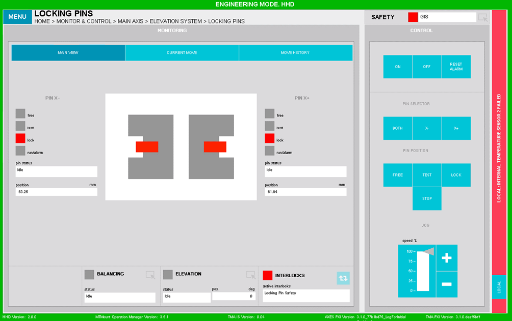
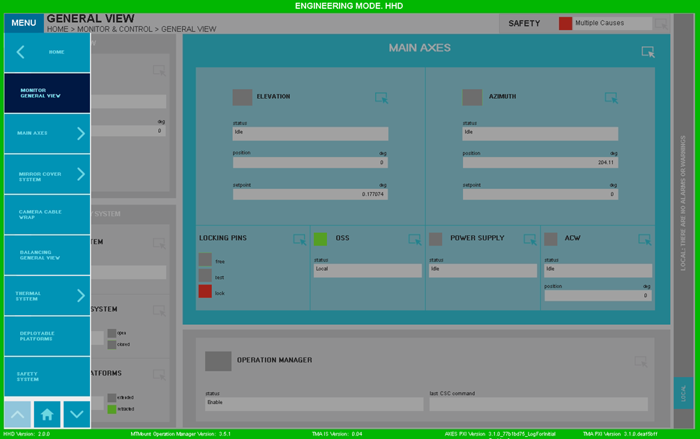
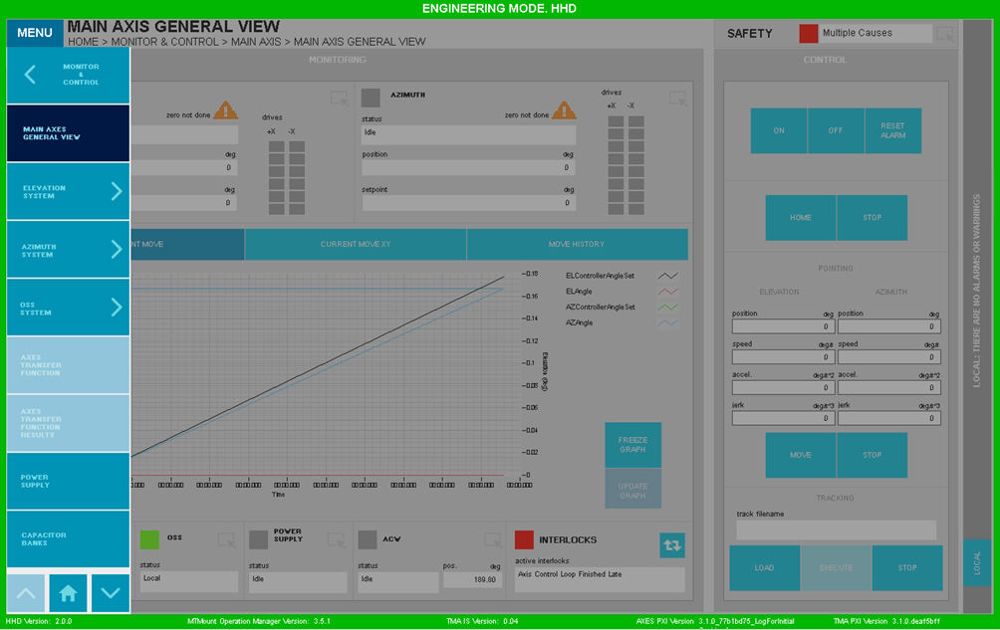

#### Common Screen Elements

HHD screens are very similar to EUI screen. On Figure 2‑103 it can be seen that they have the same “Monitoring” and “Control” structure.

*Figure 2‑103. Example HHD screen.*

The biggest change on HHD screens is the drop-down menu. On these screens the drop-down menu can be opened and closed by
pressing the "Menu" softkey, which can be seen at the top left of Figure 2-104.

*Figure 2‑104. Example of a drop-down menu.*

Another difference is in the alarms/warning bar. For the EUI display this is located at the bottom of the screens, but on
HHDs it is located vertically on the right hand side.

Finally, there is no access to the "Operation Manager” and access to the "Safety System” is smaller and has less content.
It has only one LED instead of several and an explanation of the active cause is given if there is only one. If there are
several, the text "Multiple Causes" will be displayed.

In addition, in HHDs some of the windows are disabled, see Figure 2‑105.

*Figure 2‑105. Example of a disabled screen.*
